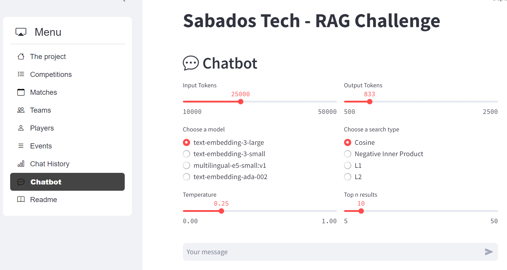
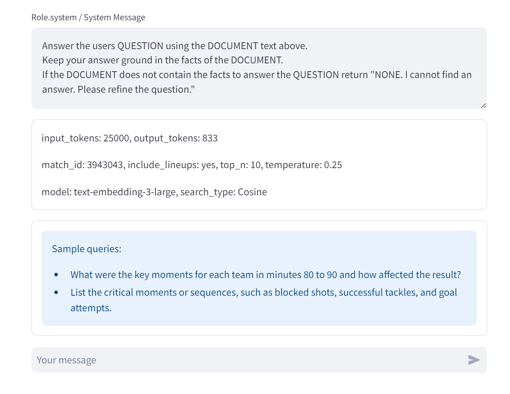

## Chatbot

This is the end result. To get there we have followed this journey/steps:

### Data preparation and loadding to Azure Postgres Flexible

The data preparation process involves several key steps. First, download the data from `Statsbomb` to a local folder. Next, store this data in a local PostgreSQL database, then load it into an Azure PostgreSQL instance. For detailed instructions on setting up PostgreSQL both locally and on Azure, refer to the official documentation: [Azure PostgreSQL Quickstart](https://learn.microsoft.com/en-us/azure/postgresql/single-server/quickstart-create-server-database-portal) and [Postgres Docker Image](https://www.docker.com/blog/how-to-use-the-postgres-docker-official-image/).

The data preparation includes downloading matches data from GitHub, storing it in PostgreSQL, and retrieving additional data like lineups and events. This is managed by the script `01-download_to_local.py`, which utilizes methods from `module_github.py` to download the data and `module_postgres.py` to load it into the local database. Ensure the PostgreSQL database is set up and tables are created as specified in the `tables_setup_onprem.sql` file before loading the data.

For loading data into PostgreSQL, use the script `02-load_data_into_postgres_from_local.py`. This script focuses on loading events and lineups data and creating the `events_details` table efficiently. It uses dedicated SQL scripts to transform and insert data directly within the database, optimizing performance and avoiding inefficient row-by-row operations.

Once the data is prepared and stored locally, use the script `03-load_data_into_azure_postgres.py` to transfer it to Azure PostgreSQL. This script handles the connection to the Azure instance, exports data from the local PostgreSQL database, and imports it into the Azure environment. After migration, verify the integrity of the data and optimize performance by configuring indexes and adjusting settings as necessary. For detailed instructions, refer to the [Azure PostgreSQL Documentation](https://learn.microsoft.com/en-us/azure/postgresql/).

### Embeddings oriented database modeling design

#### Process of Creating the `minutewise` and `quarter_minute` Tables

The process starts with the creation of the `minutewise` table, where match data is divided into 90-minute segments aprox per `match_id`. This table is used for capturing event data and player actions during each minute of the match. The SQL script `tables_setup_azure_open_ai-create-minutewise.sql` is responsible for setting up this table in the Azure PostgreSQL database. One of the key features is the `summary_embedding` column, which stores a 384-dimensional vector generated using the `multilingual-e5-small:v1` model. The table below includes all the models used (both local postgress, and Azure Open AI). This process leverages the PostgreSQL extension `pgvector`, which allows the storage and querying of vector data.

Below is a table summarizing the vector size, column names, calculated columns, extension, and model used for table `events_details__minutewise`:

| Column Name                     | Model Used                         | Vector Size |
|----------------------------------|------------------------------------|-------------|
| `summary_embedding`              | `multilingual-e5-small:v1`         | 384         |
| `summary_script_embedding`       | `multilingual-e5-small:v1`         | 384         |
| `summary_embedding_ada_002`      | `text-embedding-ada-002`           | 1536        |
| `summary_embedding_t3_small`     | `text-embedding-3-small`           | 1536        |
| `summary_embedding_t3_large`     | `text-embedding-3-large`           | 3072        |

Where we create both Cosine Similarity and Inner Product indexes for query efficiency:

| Index Name                          | Column Name                  | Vector Operation      |
|-------------------------------------|------------------------------|-----------------------|
| `events_details__min__se_vIP`       | `summary_embedding`           | `vector_ip_ops`       |
| `events_details__min__se_cos`       | `summary_embedding`           | `vector_cosine_ops`   |
| `events_details__min__sse_vIP`      | `summary_script_embedding`    | `vector_ip_ops`       |
| `events_details__min__sse_cos`      | `summary_script_embedding`    | `vector_cosine_ops`   |
| `events_details__min__ada_002_vIP`  | `summary_embedding_ada_002`   | `vector_ip_ops`       |
| `events_details__min__ada_002_cos`  | `summary_embedding_ada_002`   | `vector_cosine_ops`   |
| `events_details__min__t3_small_vIP` | `summary_embedding_t3_small`  | `vector_ip_ops`       |
| `events_details__min__t3_small_cos` | `summary_embedding_t3_small`  | `vector_cosine_ops`   |

Next, the `quarter_minute` table is created using the script `tables_setup_azure_open_ai-create-quarter_sec.sql`. This table divides each minute into four equal parts, resulting in a total of 360 rows for a 90-minute match (4 segments per minute). The granularity of this table is crucial for more detailed event analysis, capturing finer nuances in player movement and match events that happen within a shorter timespan. Similar to the `minutewise` table, it includes a `summary_embedding` column that stores 384-dimensional embeddings generated with the `multilingual-e5-small:v1` model. The ability to store these embeddings using the `pgvector` extension allows for efficient processing of vector data.

The following columns were added to the `events_details__quarter_minute` table to store embeddings generated by different AI models, utilizing the `vector` type with various dimensions:

| Column Name                     | Model Used                         | Vector Size |
|----------------------------------|------------------------------------|-------------|
| `summary_embedding`              | `multilingual-e5-small:v1`         | 384         |
| `summary_embedding_ada_002`      | `text-embedding-ada-002`           | 1536        |
| `summary_embedding_t3_small`     | `text-embedding-3-small`           | 1536        |
| `summary_embedding_t3_large`     | `text-embedding-3-large`           | 3072        |

These embeddings are generated using Azure's AI services, or local AI progress and are automatically stored in the table. They enable advanced vector-based analysis for match events on a quarter-minute basis, providing fine-grained insights into game dynamics.

The following indexes were created on the `events_details__quarter_minute` table to optimize querying of vector embeddings using different similarity metrics (Inner Product and Cosine Similarity):

| Index Name                          | Column Name                  | Vector Operation      |
|-------------------------------------|------------------------------|-----------------------|
| `events_details__qm__se_vIP`        | `summary_embedding`           | `vector_ip_ops`       |
| `events_details__qm__se_cos`        | `summary_embedding`           | `vector_cosine_ops`   |
| `events_details__qm__ada_002_vIP`   | `summary_embedding_ada_002`   | `vector_ip_ops`       |
| `events_details__qm__ada_002_cos`   | `summary_embedding_ada_002`   | `vector_cosine_ops`   |
| `events_details__qm__t3_small_vIP`  | `summary_embedding_t3_small`  | `vector_ip_ops`       |
| `events_details__qm__t3_small_cos`  | `summary_embedding_t3_small`  | `vector_cosine_ops`   |

### Questions to ask in the football domain

We have built a dataset of question to test the model.
These questions are locate in [questions](questions.json).
It is pending to test the queries using L1 and L2 proximity algoritms.

| Top-N Value | Search Type | Count of Occurrences |
|-------------|-------------|----------------------|
| 10          | Cosine      | 28                   |
| 10          | InnerP      | 9                    |
| 5           | Cosine      | 3                    |
| 5           | InnerP      | 9                    |

These are 5 examples of the 18 patterns we have created:

### Queries samples

| Question Number | Search Type | Top-N | Query                                                                                                               |
|-----------------|-------------|-------|---------------------------------------------------------------------------------------------------------------------|
| Q-001           | Cosine      | 10    | Count the successful passes each team completed in the first half (minutes 41-47) and the second half (minutes 45-50), and what impact did these passes have on their game performance? |
| Q-002           | Cosine      | 10    | Which players recorded the highest number of carries and passes in both halves, and how did their performances influence the overall strategies of the teams? |
| Q-003b          | Cosine      | 10    | What were the average pass lengths in minutes between 30 and 45?                                                    |
| Q-006c          | InnerP      | 10    | What shots on goal did each team take in minutes between 60 and 90?                                                 |
| Q-010           | InnerP      | 5     | List the critical moments or sequences, such as blocked shots, successful tackles, and goal attempts.               |

### Querying the database using embeddings

Probably this was the funiest and most challenging part of the project. The journey started with the `minutewise` table, which divides each match into 90-minute segments, giving a broad overview of the match. Using this table, we began testing various search methods to evaluate the similarity of embeddings generated by models like `multilingual-e5-small:v1`, `text-embedding-ada-002`, `text-embedding-3-small`, and `text-embedding-3-large`. Each embedding captures unique features of match events, allowing us to explore how different search types can affect performance. Our primary focus was on Cosine Similarity and Inner Product (IP) searches, as they are widely used for vector-based operations.

In the first round of testing with the `minutewise` table, we used Cosine Similarity to compare embeddings. Cosine Similarity focuses on the angle between vectors rather than their magnitude, making it particularly effective when the overall scale of data varies but relationships remain the same. As we tested Cosine Similarity on match data, it provided solid results, especially in identifying key moments in the game that were structurally similar, such as pressing sequences or build-ups leading to goal-scoring chances.

Next, we switched to Inner Product (IP) search. IP compares the magnitude and direction of vectors and is more sensitive to the strength of embeddings. When using IP on the `minutewise` data, we observed that it excelled at identifying high-intensity moments, such as goal-scoring opportunities or crucial defensive interventions. This search method, however, was more prone to overemphasizing events with stronger embeddings, which could sometimes lead to biased results toward the most frequent or impactful events.

After completing the trials with `minutewise`, we transitioned to the more granular `quarter_minute` table. This table splits each minute into four 15-second intervals, providing more detailed insights into the match dynamics. With this finer level of detail, we decided to test additional search methods—L1 (Manhattan distance) and L2 (Euclidean distance). L1 measures the absolute differences between vectors, while L2 calculates the direct distance between two points in space, making both methods ideal for short, rapid events.

### RAG pattern implementation

### High-Level Overview of `process_prompt`, `process_prompt_from_web` and `search_details_using_embeddings` Methods

The `process_prompt` and `process_prompt_from_web` method is designed to handle the initial processing of a user’s query or request. It takes a natural language prompt as input, processes it to understand the key components or intent, and prepares the data for further analysis. The primary function of this method is to transform user input into a structured format that can be fed into machine learning models, particularly for embedding generation. This method often involves tokenization, cleaning, or even transforming the prompt into a format suitable for vector embeddings. The result is typically a vector representation of the prompt, which is essential for downstream search operations.

On the other hand, the `search_details_using_embeddings` method focuses on retrieving detailed results based on the embeddings generated from the prompt. This method utilizes vector embeddings to compare the processed prompt against precomputed embeddings stored in a database (for instance, in a table like `minutewise` or `quarter_minute`). It performs a similarity search to find the closest matches or relevant events in the dataset. The method could use various search techniques such as Cosine Similarity, Inner Product (IP), or other vector distance metrics like L1 or L2, depending on the use case. The core goal of this method is to return the most relevant data points based on the user’s query.

| Method Name                    | Input                  | Output                         | Description                                                                            |
|---------------------------------|------------------------|--------------------------------|----------------------------------------------------------------------------------------|
| `process_prompt`                | User's natural language prompt | Vector embedding or structured format | Transforms and processes the input prompt for embedding generation and further analysis.|
| `process_prompt_from_web`                | User's natural language prompt | Vector embedding or structured format | Transforms and processes the input prompt for embedding generation and further analysis.|
| `search_details_using_embeddings`| Vector embedding or processed prompt | List of relevant results or details  | Retrieves matching results from a database using various similarity search techniques.  |

The methods work in tandem, with `process_prompt`, and `process_prompt_from_web` handling the input transformation and `search_details_using_embeddings` focusing on the search and retrieval of relevant data based on embeddings. While the first method ensures that the user’s query is understood and converted into a machine-readable format, the second method focuses on finding detailed answers or relevant events that align with the user's intent. This separation of concerns allows for flexible handling of complex queries and large datasets.

Overall, these methods form the backbone of an AI-driven search or query system, where natural language prompts are processed and compared against vast datasets using vector-based searches. The combination of prompt processing and efficient embedding-based searches ensures that the system can handle a wide variety of queries with high accuracy and relevance.

See the methods documentation in [module_azureopenai.py file](./python/module_azureopenai.py).

## Chatbot Application

This application leverages **Streamlit** to create an intuitive, interactive web interface for exploring data and executing various functions. Streamlit provides an easy-to-use framework that allows developers to transform Python scripts into shareable web applications quickly. This capability makes Streamlit an excellent choice for building proof-of-concepts (POCs) or rapid prototypes, as it requires minimal setup and offers a smooth learning curve for anyone familiar with Python.

The application implements various features such as displaying data visualizations, including charts, tables, and dashboards. It also allows users to interact with backend functions through web elements like buttons, dropdowns, and text boxes, making it an ideal tool for fast experimentation and real-time feedback. The design focuses on simplicity and ease of use, enabling non-technical users to interact with data and functions without deep coding knowledge. Check out the [Streamlit documentation](https://docs.streamlit.io) to learn more about these powerful features.For additional capabilities, explore the [official API reference](https://docs.streamlit.io/library/api-reference) provided by Streamlit.

### Menu Options Summary

| **Option Name**      | **Description**                                                                                                                                           |
|----------------------|-----------------------------------------------------------------------------------------------------------------------------------------------------------|
| **The Project**, **Readme**, **About Us**         | This section provides an overview of the project, explaining its goals, motivations, challenges, and the problem it addresses. It introduces the key features and objectives.|
| **Competitions**, **Matches**, **Teams**, **Players**, **Events**, **Tables Information**     | Displays information on the data exposed by statsbomb. It shows a few graphs, histograms, and charts to understand the football data domain.   |
| **Chat History**      | Shows a log of past chatbot interactions we have implemented. Useful for reviewing previous queries and responses, helping users track their exploration of the data.             |
| **Chatbot**           | An interactive feature where users can ask questions to the chatbot. It assists in retrieving data and providing insights based on user queries.             |

#### Chat History

The **Chat History** section implements the functionality to log and review past interactions with a **chatbot**, focusing on retrieving specific data from various sources such as **databases** or **APIs**. The chatbot processes **user queries** about match events, and the **chat history** allows users to revisit these queries, helping them track what information was previously fetched.

The data for **chat history** shows the queries results we have run during the project development. Results are stored in ./data/scripts_summary/Answers section. It contain 20+ different queries execution.

The **response schema** consists of several components: the **system message**, **search term**, **match ID**, the detailed **answer**, and sometimes a **data frame** with additional event details. The example response shows the number of successful passes by each team in specified match periods, followed by detailed **event logs** for both teams, including specific actions and match events such as **fouls**, **passes**, and **goal attempts**.

#### Chat 

The `Chat` function in this application manages the user inputs and settings when interacting with the **GPT model**. It provides a user-friendly interface using **Streamlit** components, allowing users to adjust parameters such as the **number of tokens**, **model type**, **temperature**, and **search method**. This function is designed to give users control over the query settings when they are working with **AI-generated responses**, ensuring flexibility based on the needs of the task.

In a nutshell this option is a wrapper to call the Azure Open AI model using the RAG pattern. The RAG pattern we have implemented works like this:

- search in the database with Cosine or Inner Product algorithm for relevent embeddings acording to the search term.
- the query returns the ids (primary keys), and the text summary of the relevant data portion.
- with the ids, we go to the database to get the previous and the next item for each row, and remove duplicate ids.
- then, we add some data from the database like lineups, and game result.
- with the complete dataset, we build the prompt and call Open AI for summarization.
- the call to Azure Open AI is run with the configuration we get from the web application (temperature, input and output tokens, search method (cosine or nIP), and login options)
- the response from Azure Open AI is showed in the application.

In addition to configuring the query settings, the `call_gpt` function integrates several **sliders** and **radio buttons** for seamless interaction. These components make it easy for users to define the behavior of the GPT model for each specific query, ensuring a customized approach to data retrieval or chatbot interactions. Below are the details of the options available in the `call_gpt` function:

### Details of call_gpt Options

1. **Input Tokens**
   - This slider lets users configure the **input tokens** for the GPT model. The minimum value is **10,000** and the maximum is **50,000**, with a default value set to the midpoint. This controls the maximum number of tokens that the model can take as input.

2. **Output Tokens**
   - Another slider for setting the **output tokens**, which defines how many tokens the model can return in a response. Users can set this between **500** and **2,500**, with a default value of one-third of the maximum. This option helps limit the length of the AI’s responses.

3. **Model Selection**
   - The function offers a **radio button** for choosing the model to be used. The available models include `"text-embedding-3-small"`, `"multilingual-e5-small:v1"`, and `"text-embedding-ada-002"`. This allows users to select the most suitable model for their task, based on performance and specificity.

4. **Search Type**
   - A **radio button** lets users choose the **search method** for retrieving embeddings or results. Options include `"Cosine"`, `"Negative Inner Product"`, `"L1"`, and `"L2"`. Each method has different implications on how similarities between items are calculated.

5. **Temperature**
   - The **temperature slider** allows users to adjust the randomness of the model’s responses. It ranges from **0.0** (completely deterministic) to **1.0** (more random responses), with a default value of **0.25**. This setting affects the creativity or diversity of the generated responses.

6. **Top N Results**
   - This slider determines the **number of top results** to return when searching for the best matches. The minimum is **5**, and the maximum is **50**, with a default value set at **10**. This parameter defines how many relevant results the model should retrieve from the database or API.

7. **System Message and Questions**
   - The function includes a **text area** for users to edit the **system message**. This system message influences the context of the GPT model’s responses, helping guide the model in its responses to match specific needs.
