# RAG Challenge

## Overview

This readme describes the web-app we have created for the challenge.

```bash
.\cd python
.\streamlit run main_streamlit.py

```

In each page there is an option button to consume the data from local postgres, or from Azure postgres PaaS. If using the local data, the application is not prepared to run the queries to the embeddings out of Azure postgres. This means that the chatbot would not work.

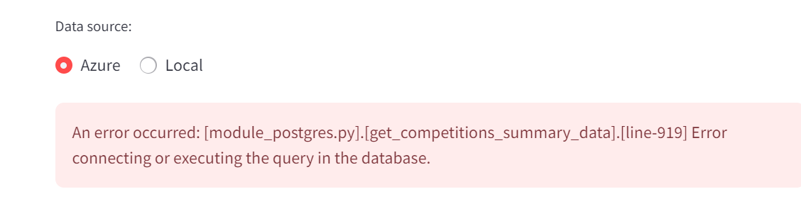

Chatbot configuration options (detailed below in the chatbot section):

- Input tokens.
- Output tokens.
- model to use.
- Distance calculation algorithm (only cosine and inner product tested).
- Temperature.
- Top n.
- Role.System message.
- Role.User message.
- Showing logs (real data used for the answer).

TODO. Detail.

## The project

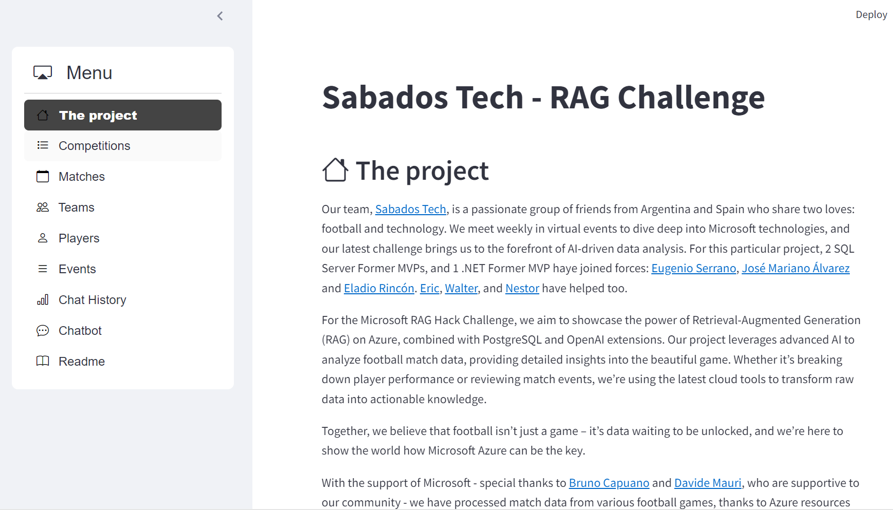

## Competitions

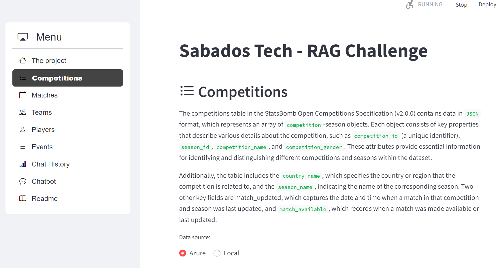


## Matches

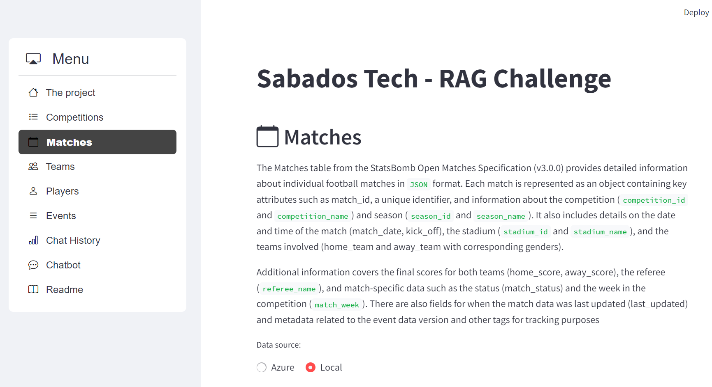


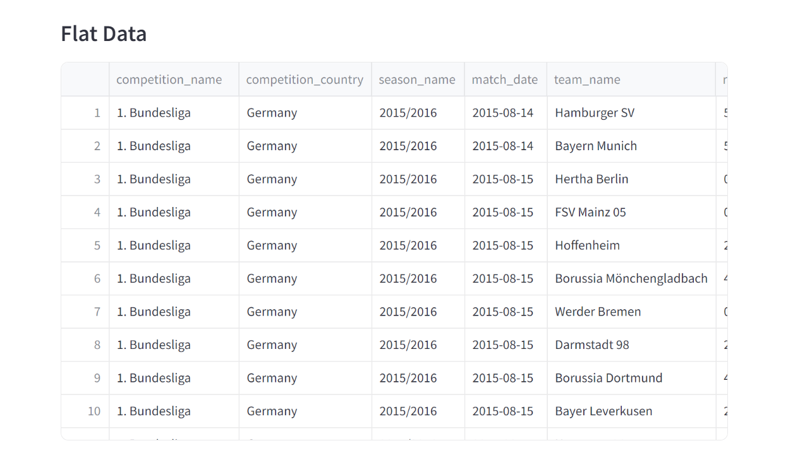

## Teams


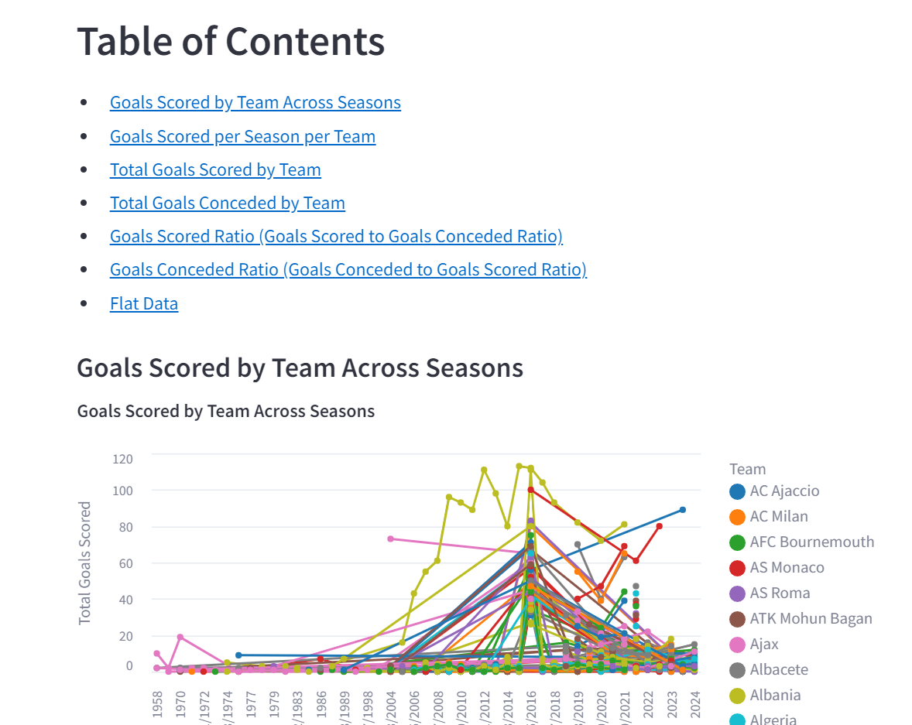


## Players

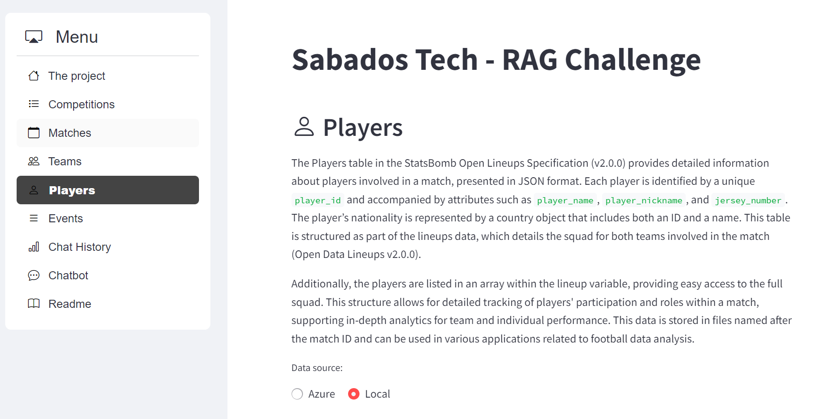
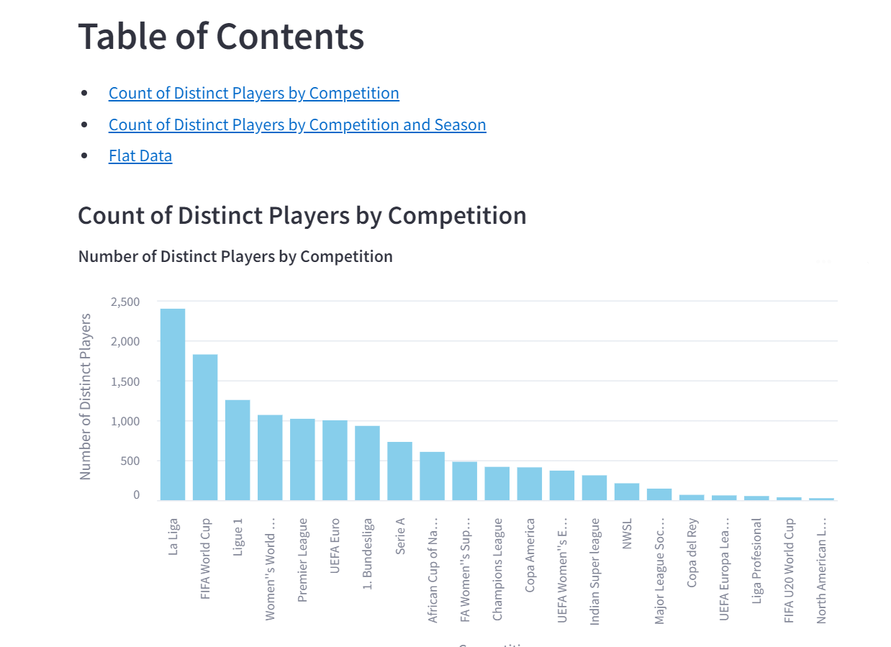

## Events


## Chat History

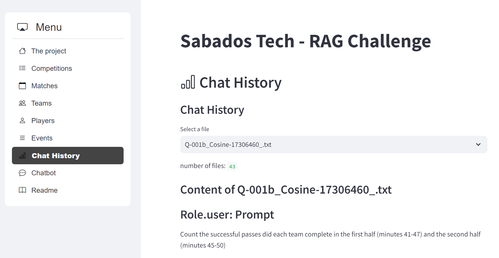
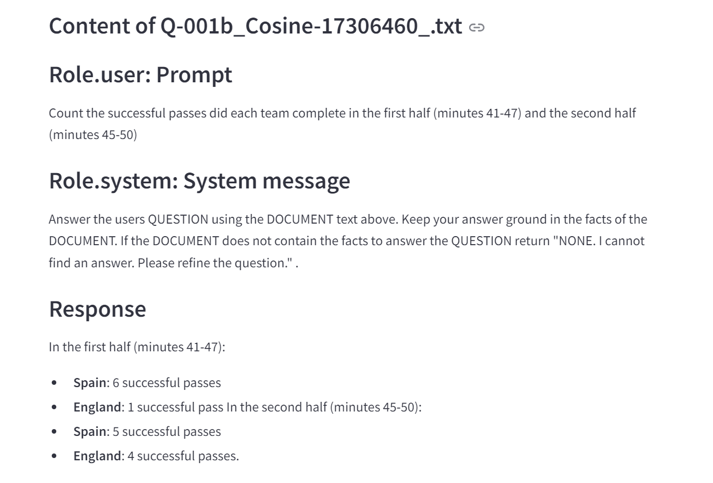


## Chatbot


## Readme

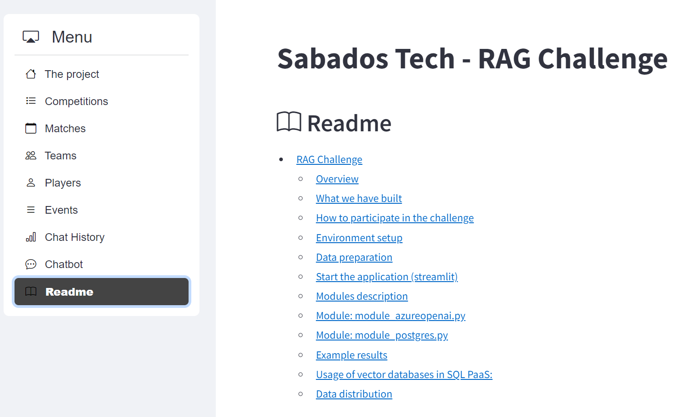
