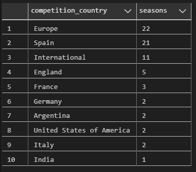
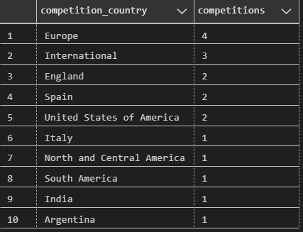
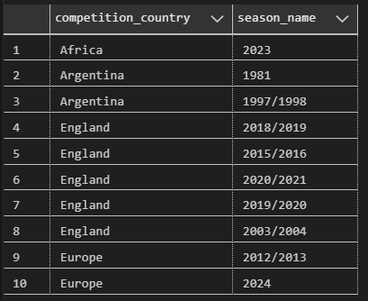
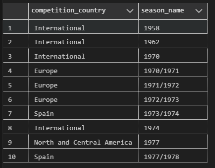
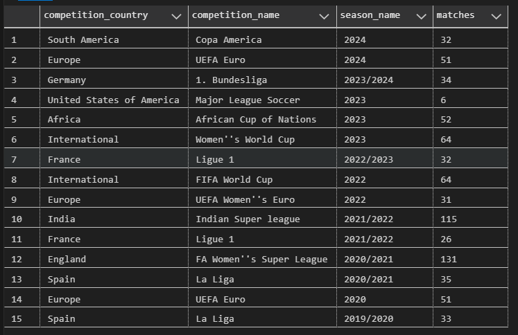

# RAG Challenge


## Overview

Our team, Sabados Techs, is a passionate group of friends from Argentina and Spain who share two loves: football and technology. We meet weekly in virtual events to dive deep into Microsoft technologies, and our latest challenge brings us to the forefront of AI-driven data analysis.

For the Microsoft RAG Hack Challenge, we aim to showcase the power of Retrieval-Augmented Generation (RAG) on Azure, combined with PostgreSQL and OpenAI extensions. Our project leverages advanced AI to analyze football match data, providing detailed insights into the beautiful game. Whether it’s breaking down player performance or reviewing match events, we’re using the latest cloud tools to transform raw data into actionable knowledge.

Together, we believe that football isn’t just a game – it’s data waiting to be unlocked, and we’re here to show the world how Microsoft Azure can be the key.

With the support of Microsoft—and a special thanks to [Bruno Capuano](https://x.com/elbruno) and  [Davide Mauri](https://x.com/mauridb), who are supportive to our community.
We have processed match data from various football games, thanks to the resources provided by [Verne Tech](https://www.vernegroup.com/). However, we would love to see Microsoft provide even more backing to make this initiative bigger, more consistent, and impactful. This project has motivated us to dive deeper into AI-driven solutions, and if we win, we’re committed to donating our prize to a good cause.

We’d love to secure Azure credits to process the full set of matches from [StatsBomb](https://github.com/statsbomb/open-data) and develop a Version 2 of this project.

Football is more than a game to us—it’s data, passion, and endless possibilities. WE LOVE FOOTBALL and with Azure and OpenAI, we’re ready to show the world just how powerful these technologies can be in transforming the way we analyze the sport we love!


Features
- Data Loading: Download and import match data into PostgreSQL.
- Data Processing: Extract, summarize, and analyze match details.
- Integration: Interface with Azure for data transfer and use OpenAI for match summaries.


- Load data from https://github.com/statsbomb/open-data into postgres.


### How to participate in the challenge


- WIP for Microsoft RAG challenge:
https://github.com/microsoft/RAG_Hack?tab=readme-ov-file#raghack-lets-build-rag-applications-together

- Official event: https://reactor.microsoft.com/es-es/reactor/events/23332/


## Install dependencies

```bash
pip install -r requirements.txt
```

## Configure environment variables

Fill in the .env file with your data. see .env.example file.

```bash
    # Base URL to access data on GitHub
BASE_URL=https://github.com/statsbomb/open-data/raw/master/data

REPO_OWNER=statsbomb
REPO_NAME=open-data
LOCAL_FOLDER=./data

# Configuración de la base de datos
DB_SERVER=your_server_name.database.windows.net
DB_NAME=your_database_name
DB_USER=your_username
DB_PASSWORD=your_password
```

## Modules description


| **Module Name**           | **Purpose**                                                                 | **Functions**                                                                                                    |
|---------------------------|-----------------------------------------------------------------------------|------------------------------------------------------------------------------------------------------------------|
| `module_github.py`         | Interacts with GitHub API to retrieve repository data and download files.   | `get_json_list_from_repo`, `download_file_from_repo_url`, `download_data_from_github_repo`, `get_github_data_from_matches` |
| `module_azureopenai.py`    | Connects to Azure OpenAI API for text generation, token management, and data retrieval. | `get_chat_completion_from_azure_open_ai`, `count_tokens`, `get_tokens_statistics_from_table_column`, `create_and_download_detailed_match_summary`, `get_top_n_results_from_summary_column`, `get_dataframe_from_ids`, `get_game_result_data`, `get_game_players_data` |
| `module_postgres.py`       | Handles PostgreSQL database operations including data transfer and processing match information. | `copy_data_from_postgres_to_azure`, `load_lineups_data_into_postgres`, `import_json_to_db`, `get_manager_info`, `get_json_events_details_from_match_id`, `download_match_script` |


### Module: module_github.py

#### `get_json_list_from_repo(repo_owner, repo_name, dataset)`
Retrieves a list of JSON files from a GitHub repository by traversing the first-level subdirectories.
- **Parameters:**
  - `repo_owner (str)`: The owner of the GitHub repository.
  - `repo_name (str)`: The name of the GitHub repository.
  - `dataset (str)`: The dataset directory within the repository.
- **Returns:** `pandas.DataFrame`: A DataFrame containing the dataset, subdirectory, and URL of each JSON file.

#### `download_file_from_repo_url(url, path, dir, subdir)`
Downloads a file from a given URL and saves it in the specified local path.
- **Parameters:**
  - `url (str)`: The URL of the file to download.
  - `path (str)`: The destination directory path.
  - `dir (str)`: The name of the directory.
  - `subdir (str)`: The name of the subdirectory.
- **Returns:** None. It prints the result of the download process.

#### `download_data_from_github_repo(repo_owner, repo_name, dataset_name, local_folder)`
Downloads data from a GitHub repository for the specified dataset and saves it to the local folder while preserving the repository structure.
- **Parameters:**
  - `repo_owner (str)`: The owner of the GitHub repository.
  - `repo_name (str)`: The name of the GitHub repository.
  - `dataset_name (str)`: The name of the dataset.
  - `local_folder (str)`: The local folder to save the files.
- **Returns:** None.

#### `get_github_data_from_matches(repo_owner, repo_name, dataset_name, local_folder)`
Retrieves data from GitHub related to match datasets and stores it in the specified local folder.
- **Parameters:** Various arguments related to the GitHub repository and dataset.
- **Returns:** None.


## Module: module_azureopenai.py

#### `get_chat_completion_from_azure_open_ai(system_message, user_prompt, temperature, tokens)`
Retrieves a chat completion from Azure OpenAI API.
- **Parameters:**
  - `system_message (str)`: The system message.
  - `user_prompt (str)`: The user prompt.
  - `temperature (float)`: The temperature value for generating chat completions.
  - `tokens (int)`: The maximum number of tokens for generating chat completions.
- **Returns:** `str`: The generated chat completion.

#### `count_tokens(prompt)`
Counts the number of tokens in the given prompt.
- **Parameters:** `prompt (str)`: The prompt to count tokens from.
- **Returns:** `int`: The number of tokens in the prompt.

### `get_tokens_statistics_from_table_column(source, table_name, column_name, filter, num_rows)`
Retrieves statistics about tokens in a specified table from the database.
- **Parameters:**
  - `source (str)`: The database source ("azure" or others).
  - `table_name (str)`: The name of the table.
  - `column_name (str)`: The name of the column to retrieve data from.
  - `filter (str)`: The filter condition for the query.
  - `num_rows (int)`: The number of rows to retrieve.
- **Returns:** `dict`: Token statistics, including total rows, mean, median, and standard deviation of tokens.

#### `create_and_download_detailed_match_summary(match_id, rows_per_prompt, file_prompt_size, temperature, system_message, tokens, local_folder)`
Generates a detailed match summary by splitting a match into multiple prompts and downloading the summary to a file.
- **Parameters:** Various arguments related to the match, prompt size, and temperature for generating the summary.
- **Returns:** None.

#### `get_top_n_results_from_summary_column(source, table_name, column_name, top_n, search_term, system_message, temperature, input_tokens, output_tokens)`
Fetches the top `n` results from the summary column based on the search term and other parameters.
- **Parameters:** Various arguments related to the source, table, and search term.
- **Returns:** A tuple with the prompt and the summary of the search results.

#### `get_dataframe_from_ids(source, table_name, summary, ids)`
Retrieves a DataFrame from the database using the given source, table name, summary column, and a list of IDs.
- **Parameters:**
  - `source (str)`: The source of the data (either "azure" or other).
  - `table_name (str)`: The table name.
  - `summary (str)`: The summary column to query.
  - `ids (list)`: A list of IDs to filter the query.
- **Returns:** `pandas.DataFrame`: The resulting DataFrame.

#### `get_game_result_data(source, match_id)`
Fetches game result data for a specific match from the database.
- **Parameters:**
  - `source (str)`: The source of the data ("azure" or other).
  - `match_id (int)`: The match ID.
- **Returns:** `str`: The game result data.

#### `get_game_players_data(source, match_id)`
Retrieves player data for a specific match from the database.
- **Parameters:**
  - `source (str)`: The source of the data ("azure" or other).
  - `match_id (int)`: The match ID.
- **Returns:** `str`: The player data.


## Module: module_postgres.py

#### `copy_data_from_postgres_to_azure(table_name, columns_list, match_id)`
Connects to a local PostgreSQL database and transfers data to an Azure PostgreSQL database.
- **Parameters:**
  - `table_name (str)`: The name of the table to copy data from.
  - `columns_list (str)`: A list of column names to transfer.
  - `match_id (int)`: The match ID to filter the data. If `<= 0`, all data will be copied.
- **Returns:** None. Outputs feedback on the data transfer process, including rows copied.

#### `load_lineups_data_into_postgres(local_folder)`
Imports lineup data from JSON files into the PostgreSQL database.
- **Parameters:** `local_folder (str)`: The directory path containing the lineup JSON files.
- **Returns:** None. Provides feedback on the number of records processed and inserted.

#### `import_json_to_db(folder_name)`
Processes match data from JSON files and stores it in the PostgreSQL database.
- **Parameters:** `folder_name (str)`: The folder containing the match JSON files.
- **Returns:** None. Outputs information about the matches inserted into the database.

#### `get_manager_info(managers)`
Retrieves detailed information about football managers from the database.
- **Parameters:** `managers (str)`: The manager(s) to retrieve information for.
- **Returns:** None.

#### `get_json_events_details_from_match_id(match_id)`
Retrieves event data for a specific match from the database.
- **Parameters:** `match_id (str)`: The ID of the match to retrieve.
- **Returns:** `pandas.DataFrame`: A DataFrame containing the match event details.

#### `download_match_script(source, table_name, match_id, column_name, local_folder, minutes_chunks)`
Downloads a match script from the PostgreSQL database, splitting it into chunks based on minutes.
- **Parameters:** Various arguments related to the match and table structure.
- **Returns:** None. The script is saved to the specified local folder.


Run the script:

```bash
python main.py
```

main.py includes comments.
Python code has different methods, each for a specific purpose:

Methods are:

- module_github
  - download_data_from_github_repo
  - get_github_data_from_matches

- module_postgres
  - copy_data_from_postgres_to_azure
  - download_match_script
  - load_matches_data_into_postgres_from_folder
  - load_lineups_data_into_postgres
  - load_events_data_into_postgres

- module_azureopenai
  - create_and_download_detailed_match_summary
  - create_events_summary_from_json_rows_in_database
  - create_match_summary
  - get_tokens_statistics_from_table_column


see coments in the .py files, and methods.

All methods that acess database, assumes that .env environments are used.
See the .env.example file.


This script performs various operations related to downloading, storing, and summarizing football match data.
The script follows the following steps:
  1. Download all matches data from a GitHub repository to a local folder.
  2. Store the downloaded matches data into a PostgreSQL database.
  3. Get lineups and events data from the GitHub repository based on the matches stored in the database.
  4. Load the downloaded data into PostgreSQL from the local folder.
  5. Copy data from the local PostgreSQL database to an Azure database.
  6. Convert each row of JSON data into a prose script.
  7. Create a detailed match summary based on the summaries of each event.
  8. Create a summary of the match using OpenAI API.
  9. Download the scripts in minute chunks from the database.
  10. Get token statistics from a table column.

Please note that this script requires environment variables to be set for various parameters such as repository owner, repository name, local folder path, database server, database name, database username, database password, and Azure database server, database name, username, and password.
The script is divided into several functions, each performing a specific task. The main function is executed when the script is run as a standalone program.
For more details on each step and the parameters used, please refer to the comments in the code.
   

## Example results

Euro Final: Spain 2 - England 1.

https://www.uefa.com/euro2024/match/2036211--spain-vs-england/

https://www.youtube.com/watch?v=e1wdwgpEhdo


```bash

content = """
        Make a summary of the match. 
        Include the game result, and most relevant actions such as goals, penalties, and injuries, and cards only if players are sent off. 
        Do not invent any information, relate stick to the data. 
        Relate in prose format the goals.
        Include two sections: data relevant for analysis, and a brief description of the match in prose format: 
        """

summary = match_summary(server_azure, database_azure, username_azure, password_azure, "final_match_Spain_England_events_details__minutewise", 3943043,
                        openai_endpoint, openai_key, "gpt-4o-mini", 0.1, 15000, content)

print(summary)


```


### Match Summary
**Result:** Spain 2 - 1 England
In a tightly contested match, Spain emerged victorious against England with a score of 2-1. The match featured a series of dynamic plays and tactical maneuvers from both teams.
In a tightly contested match, Spain emerged victorious against England with a score of 2-1. The match featured a series of dynamic plays and tactical maneuvers from both teams.

**Goals:**
- **Spain:**
  - **Nicholas Williams** scored the opening goal in the 46th minute, capitalizing on a swift passing sequence that culminated in a well-placed shot past England's goalkeeper, Jordan Pickford.
  - **Mikel Oyarzabal** doubled Spain's lead in the 75th minute with a precise shot after receiving a pass from Daniel Olmo, showcasing Spain's fluid attacking play.

- **England:**
  - **Cole Palmer** pulled one back for England in the 72nd minute, scoring with a deflected shot that found its way into the net, highlighting England's resilience and ability to capitalize on opportunities.
**Key Actions:**
- **Injuries:** Both Fabián Ruiz (Spain) and Kobbie Mainoo (England) suffered injuries in the 25th minute, leading to brief stoppages in play.
  - **Cole Palmer** pulled one back for England in the 72nd minute, scoring with a deflected shot that found its way into the net, highlighting England's resilience and ability to capitalize on opportunities.
**Key Actions:**
- **Cards:** John Stones received a yellow card in the 53rd minute for a foul on Martín Zubimendi.


### Data Relevant for Analysis
- **Possession:** Spain dominated possession throughout the match, particularly in the first half, where they held 79% possession at one point.
- **Shots on Goal:** Spain had multiple attempts on goal, with notable shots from Olmo and Yamal, while England's Foden and Bellingham also tested Spain's goalkeeper, Unai Simón.
- **Defensive Actions:** Both teams displayed strong defensive efforts, with Spain's Laporte and Carvajal making crucial clearances, while England's Guehi and Shaw effectively disrupted Spain's attacking flow.
### Match Description
The match began with both teams showcasing their tactical prowess, with Spain focusing on maintaining possession through short passes and quick transitions. England applied pressure, attempting to regain control and create scoring opportunities. The first half saw Spain's dominance in possession, but England's defensive resilience kept the scoreline level.
As the second half commenced, Spain quickly took the lead with a well-executed goal from Nicholas Williams. England responded with determination, and Cole Palmer's goal reignited their hopes. However, Spain's attacking fluidity proved too much for England, culminating in Oyarzabal's decisive strike.
Despite England's late attempts to equalize, Spain's defense held firm, securing a hard-fought victory. The match highlighted the tactical battle between the two teams, with Spain's possession-based approach ultimately prevailing over England's counter-attacking strategy.


## Usage of vector databases in SQL PaaS:

- feature: https://github.com/Azure-Samples/azure-sql-db-vector-search
- requirements: https://github.com/Azure-Samples/azure-sql-db-vector-search?tab=readme-ov-file#prerequisites
- sign up: https://aka.ms/azuresql-vector-eap


## Data distribution

This script is in [tables_data_distribution](.\postgres\tables_data_distribution.sql)


### competitions by country/region
```sql
select competition_country, count(distinct season_name) seasons
from matches m
group by competition_country
order by seasons DESC limit 10;
```



### competitions by country/region
```sql
select competition_country, count(distinct competition_name) competitions
from matches m
group by competition_country
order by competitions DESC limit 10;
```


### seasons by country/region
```sql
select distinct competition_country, season_name
from matches m
order by competition_country limit 10;
```



### seasons by country/region
```sql
select distinct competition_country, season_name
from matches m
order by season_name limit 10;
```



### recent season by country/region
```sql
select competition_country, competition_name, season_name, count(*) matches
group by competition_country, competition_name, season_name
order by season_name DESC limit 15;
```



