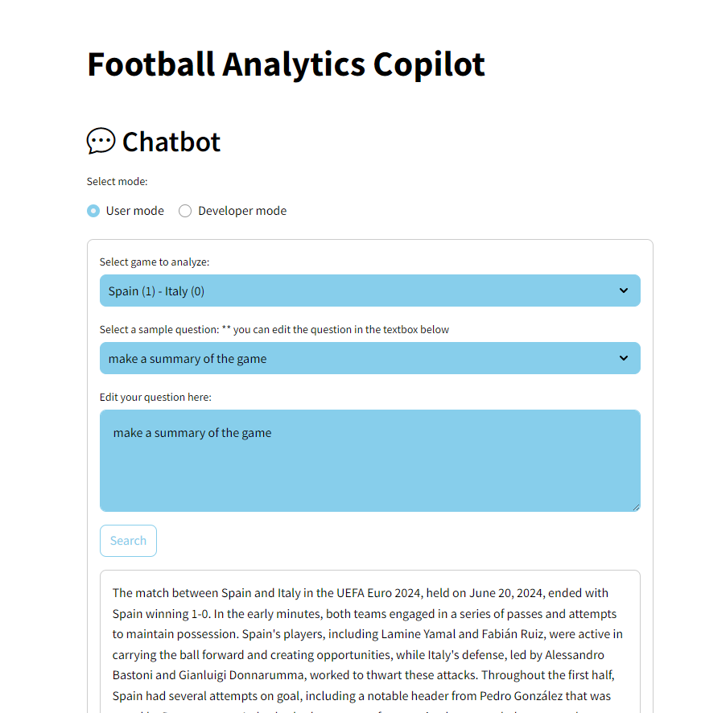
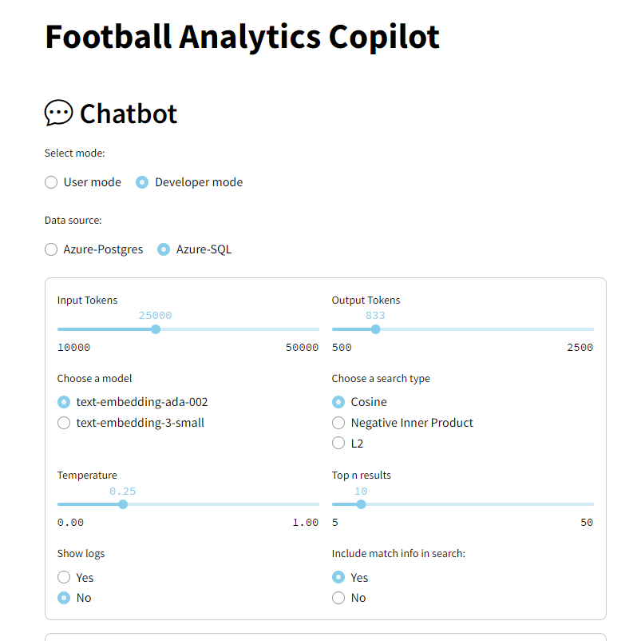

# Football Analytics Copilot - RAG Challenge

> AI-powered football match analysis using Retrieval-Augmented Generation (RAG) with Azure OpenAI and vector embeddings.

## 🎯 Project Status

**Current Version:** v3.2 - Devcontainer v2 + portable pgvector pipeline
**Primary Branch:** `develop`
**Architecture:** FastAPI Backend + React TypeScript Frontend + PostgreSQL/SQL Server
**Last Updated:** 2026-04-02

### ✅ Completed Phases (100% Original Plan + 100% Frontend Migration)

#### Original Rearchitecture Plan
- ✅ **Phase 0:** Technical Stabilization (Bug fixes, Centralized config, 4 ADRs)
- ✅ **Phase 1:** Backend/Frontend Separation (Complete layered architecture)
- ✅ **Phase 2:** Docker Local Infrastructure (Full stack containerization)

#### Frontend Web Migration Plan
- ✅ **Phase 0:** Backend Stabilization & Capabilities API
- ✅ **Phase 1:** Ingestion API & Job Management
- ✅ **Phase 2:** React TypeScript Bootstrap
- ✅ **Phase 3:** Core Operational Screens (Catalog, Operations)
- ✅ **Phase 4:** Data Explorer & Legacy Parity
- ✅ **Phase 5:** Embeddings Management & Advanced Chat
- ✅ **Phase 6:** Hardening & Production Features

### ⏳ Pending Phases

- ✅ **Phase 2A:** pgvector Migration — **completed 2026-02-20**
- ✅ **Phase 3:** Devcontainer 2.0 — **completed 2026-02-20** (postCreate + postStart + health checks)
- ⏳ **Phase 4:** Task Automation (Not started)
- ⏳ **Phase 5:** GitHub Actions CI/CD (Not started)
- ⏳ **Phase 6:** Final UX Polish (Partially complete)

### 🧪 Backend Tests

- Local backend pytest suite prepared on `feature/tests-suite`
- Current local result: `259 passed` on Python 3.12
- Remaining promotion step: commit, push branch, and open PR into `develop`

### Documentation Hub

| Document | Purpose |
|---|---|
| [CHANGELOG.md](./CHANGELOG.md) | Version history and release notes |
| [PROJECT_STATUS.md](./PROJECT_STATUS.md) | Current status, progress, and next steps |
| [PLAN_REARQUITECTURA_COMPLETO.md](./PLAN_REARQUITECTURA_COMPLETO.md) | Full architecture roadmap |
| [PLAN_MIGRACION_FRONTEND_WEB.md](./PLAN_MIGRACION_FRONTEND_WEB.md) | Frontend migration plan (completed) |
| [docs/adr/](./docs/adr/) | Architecture Decision Records |

### Branch governance

This project uses [OpenSpec](https://github.com/Fission-AI/OpenSpec) for spec-driven development.
The governance workflow (`/opsx:propose` → `/opsx:apply` → `/opsx:archive`) lives in `openspec/`.

| Branch | Status | Purpose |
|--------|--------|---------|
| `main` | Active | Production — only admins merge via PR from `develop` |
| `develop` | Active | Integration — all feature PRs target this branch |
| `feature/openspec-governance` | Active | OpenSpec adoption (to be merged into `develop`) |
| `feature/spec-kit-governance` | Obsolete | Initial governance attempt using spec-kit. Superseded by OpenSpec — kept for historical reference |
| `feature/spec-kit-streamlit-app` | Obsolete | Governance artifacts for the old Streamlit architecture. Superseded by FastAPI migration — kept for historical reference |
| `feature/010-speckit-audit` | Obsolete | spec-kit compliance audit. Superseded by OpenSpec adoption — kept for historical reference |

> **Why the pivot?** We initially adopted [spec-kit](https://github.com/github/spec-kit) (sessions 1-12
> in `docs/conversation_log.md`), but found OpenSpec to be a better fit for our multi-tool workflow
> (GitHub Copilot + Claude Code). The spec-kit branches are preserved so the team can trace the
> decision history. See `docs/PLAN_OPENSPEC_ADOPTION.md` for the full rationale.

---

## 📐 Architecture

### Current Architecture (v2.0)

```
┌──────────────────────────────────────────────┐
│  Frontend (React + TypeScript) - Port 5173   │
│  • Vite + TailwindCSS                        │
│  • TanStack Query (state management)         │
│  • React Router (navigation)                 │
│  • Full UI: Dashboard, Catalog, Chat, etc.   │
└──────────────┬───────────────────────────────┘
               │ REST API
               ↓
┌──────────────────────────────────────────────┐
│       Backend (FastAPI) - Port 8000          │
│  ┌────────────────────────────────────────┐  │
│  │ API Layer (v1)                         │  │
│  │ • /health, /capabilities, /sources     │  │
│  │ • /competitions, /matches, /events     │  │
│  │ • /statsbomb, /ingestion, /explorer    │  │
│  │ • /embeddings, /chat (RAG)             │  │
│  └──────────┬─────────────────────────────┘  │
│             ↓                                │
│  ┌────────────────────────────────────────┐  │
│  │ Services Layer                         │  │
│  │ • SearchService (RAG orchestration)    │  │
│  │ • IngestionService (data loading)      │  │
│  │ • StatsBombService (remote catalog)    │  │
│  │ • DataExplorerService (queries)        │  │
│  │ • JobService (background tasks)        │  │
│  └──────────┬─────────────────────────────┘  │
│             ↓                                │
│  ┌────────────────────────────────────────┐  │
│  │ Repositories Layer                     │  │
│  │ • PostgreSQL Repository                │  │
│  │ • SQL Server Repository                │  │
│  └──────────┬─────────────────────────────┘  │
│             ↓                                │
│  ┌─────────────────────────────────┐         │
│  │ Adapters Layer                  │         │
│  │ • OpenAI/Azure OpenAI           │         │
│  └─────────────────────────────────┘         │
└──────────────────────────────────────────────┘
               │
               ↓
┌──────────────────────────────────────────┐
│  Databases                               │
│  • PostgreSQL + pgvector (embeddings)    │
│  • SQL Server (relational data)          │
└──────────────────────────────────────────┘
```

### Key Features

#### Architecture & Infrastructure
✅ **Layered Architecture**: Clean separation (API → Services → Repositories → Domain → Adapters)
✅ **Multi-Database**: PostgreSQL (vector search) + SQL Server (relational data)
✅ **Full Stack TypeScript**: React + TypeScript frontend with type-safe API client
✅ **Containerized**: Complete Docker setup with docker-compose orchestration
✅ **OpenAPI Docs**: Auto-generated interactive documentation at `/docs`

#### Data & AI Capabilities
✅ **Semantic Search**: Vector similarity search with multiple embedding models
✅ **Multi-Model Support**: ada-002, text-embedding-3-small, 3-large, e5-large
✅ **Multi-Algorithm**: Cosine similarity, inner product, L2 distance
✅ **Multi-Language**: Automatic translation to English for search queries
✅ **RAG-Powered Chat**: AI-generated answers with context from match data

#### User Experience
✅ **Modern Web UI**: 7 comprehensive pages (Dashboard, Catalog, Chat, Explorer, etc.)
✅ **StatsBomb Integration**: Browse and import competitions/matches from open data
✅ **Job Management**: Track downloads, imports, and processing with real-time status
✅ **Dual Database Support**: Switch between PostgreSQL and SQL Server dynamically
✅ **Embeddings Control**: View status and rebuild embeddings per match/model
✅ **Developer & User Modes**: Simplified or advanced interface based on needs

---

## 🚀 Quick Start

### Option A: Docker (Recommended)

The easiest way to run the full stack locally.

**Prerequisites:** Docker and Docker Compose

1. **Clone and configure**
   ```bash
   git clone <repo-url>
   cd RAG-Challenge
   git checkout develop
   ```

2. **Set your OpenAI credentials** in `.env.docker`
   ```bash
   # Edit .env.docker with your Azure OpenAI key and endpoint
   ```

3. **Start everything**
   ```bash
   docker compose up --build
   ```

4. **Access the app**
   - Frontend: <http://localhost:5173>
   - Backend API: <http://localhost:8000>
   - API Docs: <http://localhost:8000/docs>
   - PostgreSQL: `localhost:5432` (user: `postgres`, db: `rag_challenge`) - *Solo con `--profile postgres`*
   - SQL Server: `localhost:1433` (user: `sa`)

> **💡 PostgreSQL ahorra recursos:** Por defecto PostgreSQL no se inicia para ahorrar recursos. Para iniciarlo usa: `docker compose --profile postgres up`

### Option B: Manual Setup

**Prerequisites:**

- Python 3.11+, Node 20+
- PostgreSQL 17 with pgvector OR Azure PostgreSQL Flexible Server
- SQL Server 2025 Express OR Azure SQL Database
- Azure OpenAI or OpenAI API access

1. **Clone and configure**
   ```bash
   git clone <repo-url>
   cd RAG-Challenge
   git checkout develop
   cp .env.example .env
   # Edit .env with your database and OpenAI credentials
   ```

2. **Run the backend**
   ```bash
   cd backend
   pip install -r requirements.txt
   python -m app.main
   # API: http://localhost:8000 | Docs: http://localhost:8000/docs
   ```

3. **Run the frontend**
   ```bash
   cd frontend/webapp
   npm install
   npm run dev
   # Frontend: http://localhost:5173
   ```

---

## 📖 Documentation

### Project & Architecture

| Document | Description |
|---|---|
| [CHANGELOG.md](./CHANGELOG.md) | Full version history |
| [PROJECT_STATUS.md](./PROJECT_STATUS.md) | Current status and next steps |
| [PLAN_REARQUITECTURA_COMPLETO.md](./PLAN_REARQUITECTURA_COMPLETO.md) | Full architecture roadmap |
| [PLAN_MIGRACION_FRONTEND_WEB.md](./PLAN_MIGRACION_FRONTEND_WEB.md) | Frontend migration plan |
| [docs/adr/README.md](./docs/adr/README.md) | Architecture Decision Records index |
| [docs/adr/ADR-001](./docs/adr/ADR-001-layered-architecture.md) | Layered Architecture decision |
| [docs/adr/ADR-002](./docs/adr/ADR-002-centralized-configuration.md) | Centralized Configuration decision |
| [docs/adr/ADR-003](./docs/adr/ADR-003-pgvector-migration.md) | pgvector Migration decision |
| [docs/adr/ADR-004](./docs/adr/ADR-004-local-docker-infrastructure.md) | Local Docker Infrastructure decision |

### Backend (FastAPI)

| Document | Description |
|---|---|
| [backend/README.md](./backend/README.md) | Backend overview, setup, deployment |
| [backend/app/api/README.md](./backend/app/api/README.md) | HTTP endpoints, DTOs, validation |
| [backend/app/services/README.md](./backend/app/services/README.md) | Business logic, orchestration |
| [backend/app/repositories/README.md](./backend/app/repositories/README.md) | Data access patterns |
| [backend/app/domain/README.md](./backend/app/domain/README.md) | Entities, value objects, rules |
| [backend/app/adapters/README.md](./backend/app/adapters/README.md) | External integrations (OpenAI) |

### Frontend (React TypeScript)

| Document | Description |
|---|---|
| [frontend/webapp/README.md](./frontend/webapp/README.md) | React app setup and structure |
| [config/README.md](./config/README.md) | Centralized configuration guide |

### Domain Knowledge

| Document | Description |
|---|---|
| [docs/statsbomb-intro.md](./docs/statsbomb-intro.md) | StatsBomb data structure explained |
| [docs/app-use-case.md](./docs/app-use-case.md) | Application use cases and demo questions |
| [docs/data-distribution.md](./docs/data-distribution.md) | Database statistics and data layout |

---

## 🎨 The Application

### Modern React Web Interface

The application features a modern, responsive web interface built with React and TypeScript:

#### Key Pages
1. **Dashboard** - System health, database status, and recent jobs overview
2. **Data Sources** - Database connectivity testing and capability matrix
3. **StatsBomb Catalog** - Browse and select competitions/matches from open data
4. **Operations** - Download, load, and process data with job tracking
5. **Data Explorer** - Browse competitions, matches, teams, players, and events
6. **Embeddings** - View coverage status and rebuild embeddings by match
7. **Chat** - AI-powered semantic search with natural language queries

#### Features
- **Real-time Job Tracking**: Monitor downloads and imports with live status updates
- **Multi-Database Support**: Switch between PostgreSQL and SQL Server seamlessly
- **Capability-Aware UI**: Interface adapts based on available models/algorithms
- **Responsive Design**: Built with TailwindCSS for modern, mobile-friendly layouts
- **Type-Safe**: Full TypeScript coverage for reliability

### Historical Streamlit Screenshots

The repository still keeps screenshots from the original Streamlit prototype for historical reference only. The actively maintained product is the React frontend under `frontend/webapp/`.




[More screenshots →](./docs/app-screenshots.md)

---

## 🎥 Demo

[8 minutes video of the Challenge](./RAG-Challenge_Sabados_Tech.mp4)

---

## 🏗️ Project Structure

```
RAG-Challenge/
├── backend/                           # FastAPI backend
│   ├── app/
│   │   ├── api/v1/                   # HTTP endpoints (REST API)
│   │   │   ├── capabilities.py       # System capabilities & DB status
│   │   │   ├── statsbomb.py         # StatsBomb catalog API
│   │   │   ├── ingestion.py         # Data ingestion & jobs
│   │   │   ├── explorer.py          # Data browsing
│   │   │   ├── embeddings.py        # Embeddings management
│   │   │   ├── chat.py              # RAG chat endpoint
│   │   │   ├── matches.py           # Match queries
│   │   │   ├── events.py            # Event queries
│   │   │   └── health.py            # Health checks
│   │   ├── services/                 # Business logic
│   │   │   ├── search_service.py    # RAG orchestration
│   │   │   ├── ingestion_service.py # Data loading pipeline
│   │   │   ├── job_service.py       # Background job management
│   │   │   ├── statsbomb_service.py # StatsBomb API client
│   │   │   └── data_explorer_service.py
│   │   ├── repositories/             # Data access layer
│   │   │   ├── postgres.py          # PostgreSQL repository
│   │   │   └── sqlserver.py         # SQL Server repository
│   │   ├── domain/                   # Domain entities & rules
│   │   ├── adapters/                 # External integrations
│   │   │   └── openai_client.py     # OpenAI/Azure OpenAI
│   │   ├── core/                     # Config & dependencies
│   │   │   └── capabilities.py      # Capability matrix
│   │   └── main.py                   # FastAPI application
│   ├── data/                         # Static data cache
│   │   └── competitions.json        # StatsBomb catalog
│   ├── tests/                        # Backend tests
│   ├── Dockerfile                    # Backend container
│   └── requirements.txt
│
├── frontend/                          # Frontend applications
│   └── webapp/                       # Primary React app
│   │   ├── src/
│   │   │   ├── pages/               # Application pages
│   │   │   │   ├── HomePage.tsx     # Landing page
│   │   │   │   ├── DashboardPage.tsx
│   │   │   │   ├── CatalogPage.tsx  # StatsBomb browser
│   │   │   │   ├── OperationsPage.tsx # Jobs & ingestion
│   │   │   │   ├── ExplorerPage.tsx # Data explorer
│   │   │   │   ├── EmbeddingsPage.tsx
│   │   │   │   └── ChatPage.tsx     # RAG chat
│   │   │   ├── components/
│   │   │   │   ├── layout/          # Layout components
│   │   │   │   └── ui/              # UI components
│   │   │   ├── lib/
│   │   │   │   ├── api/             # Type-safe API client
│   │   │   │   │   ├── client.ts    # HTTP client
│   │   │   │   │   └── types.ts     # TypeScript types
│   │   │   │   ├── storage/         # Local storage
│   │   │   │   └── queryClient.ts   # TanStack Query config
│   │   │   ├── state/               # Global state
│   │   │   ├── App.tsx              # Main app component
│   │   │   └── main.tsx             # Entry point
│   │   ├── Dockerfile
│   │   ├── package.json
│   │   ├── vite.config.ts
│   │   └── tailwind.config.js
│
├── infra/                             # Infrastructure as code
│   └── docker/
│       ├── postgres/
│       │   └── initdb/               # Init scripts + schema
│       │       ├── 01-extensions.sql
│       │       └── 02-schema.sql
│       └── sqlserver/
│           ├── Dockerfile            # Custom SQL Server image
│           ├── setup.sh              # Custom entrypoint
│           └── initdb/
│               └── 01-schema.sql
│
├── config/                            # Centralized configuration
│   ├── settings.py                   # Pydantic settings
│   └── README.md
│
├── docs/                              # Documentation
│   ├── adr/                          # Architecture Decision Records
│   │   ├── ADR-001-layered-architecture.md
│   │   ├── ADR-002-centralized-configuration.md
│   │   ├── ADR-003-pgvector-migration.md (Accepted)
│   │   └── ADR-004-local-docker-infrastructure.md
│   ├── app-screenshots.md
│   ├── app-use-case.md
│   ├── statsbomb-intro.md
│   └── *.md
│
├── docker-compose.yml                 # Full stack orchestration
├── .env.docker                        # Docker environment (gitignored)
├── .env.example                       # Environment template
├── PLAN_REARQUITECTURA_COMPLETO.md   # Original roadmap
├── PLAN_MIGRACION_FRONTEND_WEB.md    # Frontend migration plan
└── README.md
```

---

## 🔧 Troubleshooting

### Frontend no se ve en Windows (Docker Desktop + WSL2)

Si el frontend no carga en el navegador:

1. **Verifica que el contenedor esté corriendo:**

   ```bash
   docker compose ps
   ```

2. **Revisa los logs:**

   ```bash
   docker compose logs frontend
   ```

3. **Problemas comunes:**
   - **Error de memoria (ENOMEM):** El file watcher de Vite puede fallar con volúmenes montados desde Windows. Solución: el proyecto está configurado para usar `serve` en lugar de `vite dev` en Docker.

   - **Puerto accesible pero sin respuesta:** Problema conocido de port forwarding entre Docker/WSL2 y Windows.
     - **Solución A:** Abre directamente en navegador Windows: <http://localhost:5173>
     - **Solución B:** Usa la IP del contenedor: `docker inspect rag-frontend | grep IPAddress`
     - **Solución C:** Reinicia Docker Desktop

   - **Aumentar límites de inotify (WSL2):**

     ```bash
     sudo sysctl -w fs.inotify.max_user_watches=524288
     sudo sysctl -w fs.inotify.max_queued_events=32768
     sudo sysctl -w fs.inotify.max_user_instances=1024
     ```

### Backend no se conecta a las bases de datos

Verifica que los contenedores de bases de datos estén saludables:

```bash
docker compose ps
```

Si SQL Server está `starting`, espera 30-60 segundos para que inicialice completamente.

---

## 🔧 API Endpoints

### Health & Capabilities
- `GET /` - API information and version
- `GET /api/v1/health` - Detailed health check
- `GET /api/v1/health/ready` - Readiness probe (DB connectivity)
- `GET /api/v1/health/live` - Liveness probe
- `GET /api/v1/capabilities` - Supported models/algorithms by source
- `GET /api/v1/sources/status` - Database connectivity status

### StatsBomb Catalog
- `GET /api/v1/statsbomb/competitions` - Browse available competitions
- `GET /api/v1/statsbomb/matches` - Get matches by competition/season

### Data Ingestion & Jobs
- `POST /api/v1/ingestion/download` - Download StatsBomb data
- `POST /api/v1/ingestion/load` - Load data into database
- `POST /api/v1/ingestion/aggregate` - Create aggregated tables
- `GET /api/v1/ingestion/jobs` - List all jobs
- `GET /api/v1/ingestion/jobs/{id}` - Get job details
- `POST /api/v1/ingestion/jobs/{id}/cancel` - Cancel running job
- `DELETE /api/v1/ingestion/jobs` - Clear completed jobs

### Data Retrieval
- `GET /api/v1/competitions` - List loaded competitions
- `GET /api/v1/matches` - List matches (with filters)
- `GET /api/v1/matches/{id}` - Get match details
- `GET /api/v1/events` - List match events
- `GET /api/v1/events/{id}` - Get event details

### Data Explorer
- `GET /api/v1/explorer/teams` - List teams
- `GET /api/v1/explorer/players` - List players
- `GET /api/v1/explorer/tables` - Database table information

### Embeddings Management
- `GET /api/v1/embeddings/status` - Embeddings coverage status
- `POST /api/v1/embeddings/rebuild` - Rebuild embeddings for matches

### AI-Powered Search
- `POST /api/v1/chat/search` - Semantic search with RAG-generated answers

**Interactive API Documentation:**
- Swagger UI: http://localhost:8000/docs
- ReDoc: http://localhost:8000/redoc

---

## 🧪 Testing

```bash
# Backend tests
cd backend
pytest

# With coverage
pytest --cov=app --cov-report=html
```

Current local status on `feature/tests-suite`: `259 passed`.

---

## 🛠️ Technology Stack

### Backend
- **FastAPI** - Modern async web framework
- **Pydantic** - Data validation and settings
- **PostgreSQL + pgvector** - Vector similarity search
- **SQL Server** - Relational data storage
- **Azure OpenAI** - Embeddings and chat completions

### Frontend
- **React 19** - Modern UI framework
- **TypeScript** - Type-safe JavaScript
- **Vite** - Fast build tool and dev server
- **TailwindCSS** - Utility-first CSS framework
- **TanStack Query** - Data fetching and state management
- **React Router** - Client-side routing

### Infrastructure
- **Docker & Docker Compose** - Full-stack containerization (`docker compose up`)
- **pgvector/pgvector:pg17** - PostgreSQL with vector search (local Docker)
- **SQL Server 2025 Express** - Linux container with VECTOR type support
- **GitHub Actions** - CI/CD pipeline (coming soon)

---

## 👥 Team: Sabados Tech

Our team, [Sabados Tech](https://www.youtube.com/channel/UCw89YeTGdK74ZZ97_xcI2FA), is a passionate group of friends from Argentina and Spain who share two loves: football and technology.

**Core Team:**
- [Eugenio Serrano](https://www.linkedin.com/in/eugenio-serrano/) - SQL Server Former MVP
- [José Mariano Álvarez](https://www.linkedin.com/in/josemarianoalvarez/) - SQL Server Former MVP
- [Eladio Rincón](https://www.linkedin.com/in/erincon/) - .NET Former MVP

**Contributors:**
- [Eric](https://github.com/eric-net)
- [Walter](https://github.com/Exodo77)
- [Nestor](https://github.com/nnarvaez)

---

## 🏆 Microsoft RAG Hack Challenge

This project was developed for the [Microsoft RAG Hack Challenge](https://github.com/microsoft/RAG_Hack), showcasing the power of Retrieval-Augmented Generation on Azure.

**Special Thanks:**
- [Bruno Capuano](https://x.com/elbruno) - Microsoft
- [Davide Mauri](https://x.com/mauridb) - Microsoft
- [Altia](https://www.altia.es/)

**Official Event:** [Microsoft Reactor](https://reactor.microsoft.com/es-es/reactor/events/23332/)

---

## 🎯 Mission

We'd love to secure Azure credits to process the full set of matches from [StatsBomb](https://github.com/statsbomb/open-data) and develop a Version 2.0 of this project.

In the remote event that we win the challenge, we will donate the prize to [PROA school](https://www.cba.gov.ar/escuelas-proa/) in [Mina Clavero](https://www.minaclavero.gov.ar/), a fabulous city in the province of Cordoba, Argentina.

---

## 📝 License

MIT

---

## 🌟 We Love Football!

Football is more than a game to us—it's data, passion, and endless possibilities. With Azure and OpenAI, we're showing the world just how powerful these technologies can be in transforming the way we analyze the sport we love!

⚽ **#Football #AI #RAG #Azure #OpenAI #DataScience**
