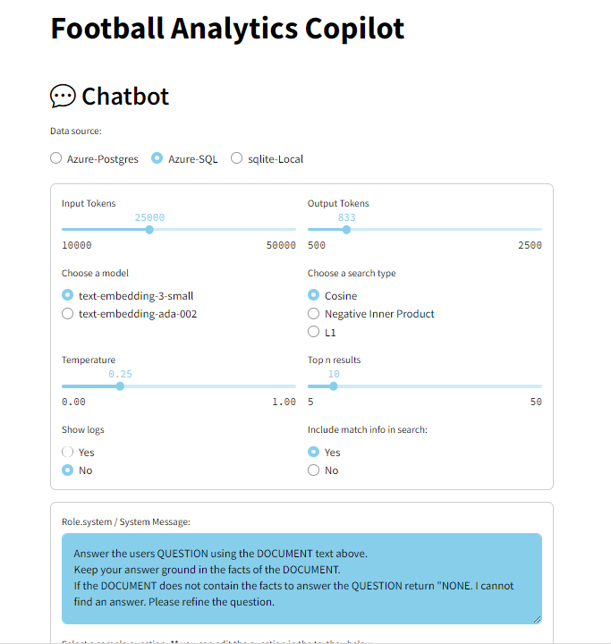
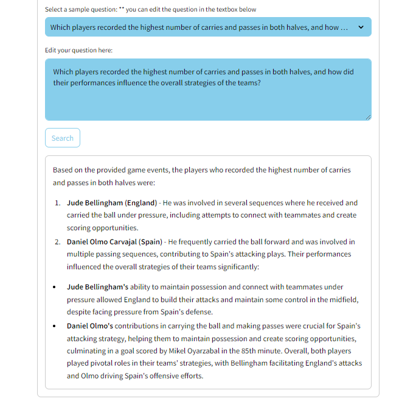
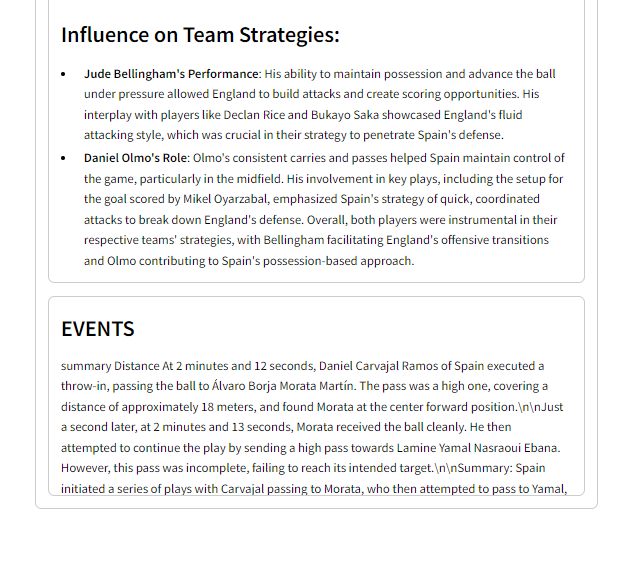

# Football Analytics Copilot - RAG Challenge

> AI-powered football match analysis using Retrieval-Augmented Generation (RAG) with Azure OpenAI and vector embeddings.

## 🎯 Project Status

**Current Version:** v2.0 - Layered Architecture (Refactored)
**Branch:** `feature/rearquitectura-completa`
**Architecture:** FastAPI Backend + Streamlit Frontend + PostgreSQL/SQL Server

### ✅ Completed Phases

- ✅ **Phase 0:** Technical Stabilization (Bug fixes, Centralized config, ADRs)
- ✅ **Phase 1:** Backend/Frontend Separation (Complete layered architecture)
- ✅ **Phase 2:** Docker Local Infrastructure (Dockerfiles, docker-compose, init scripts)
- ⏳ **Phase 2A:** pgvector Migration (Pending)
- ⏳ **Phase 3:** Devcontainer 2.0 (Pending)

See [PLAN_REARQUITECTURA_COMPLETO.md](./PLAN_REARQUITECTURA_COMPLETO.md) for the complete roadmap.

---

## 📐 Architecture

### Current Architecture (v2.0)

```
┌─────────────────────────────────────────┐
│    Frontend (Streamlit) - Port 8501    │
│  • User Interface                       │
│  • HTTP Client to Backend               │
└──────────────┬──────────────────────────┘
               │ REST API
               ↓
┌─────────────────────────────────────────┐
│     Backend (FastAPI) - Port 8000       │
│  ┌─────────────────────────────────┐   │
│  │ API Layer                       │   │
│  │ • /health, /competitions        │   │
│  │ • /matches, /events             │   │
│  │ • /chat/search (RAG endpoint)   │   │
│  └──────────┬──────────────────────┘   │
│             ↓                           │
│  ┌─────────────────────────────────┐   │
│  │ Services Layer                  │   │
│  │ • Business Logic                │   │
│  │ • Search Orchestration          │   │
│  └──────────┬──────────────────────┘   │
│             ↓                           │
│  ┌─────────────────────────────────┐   │
│  │ Repositories Layer              │   │
│  │ • PostgreSQL Repository         │   │
│  │ • SQL Server Repository         │   │
│  └──────────┬──────────────────────┘   │
│             ↓                           │
│  ┌─────────────────────────────────┐   │
│  │ Adapters Layer                  │   │
│  │ • OpenAI/Azure OpenAI           │   │
│  └─────────────────────────────────┘   │
└─────────────────────────────────────────┘
               │
               ↓
┌──────────────────────────────────────────┐
│  Databases                               │
│  • PostgreSQL + pgvector (embeddings)    │
│  • SQL Server (relational data)          │
└──────────────────────────────────────────┘
```

### Key Features

✅ **Layered Architecture**: Clean separation of concerns (API → Services → Repositories → Domain)
✅ **Multi-Database**: PostgreSQL for vector search, SQL Server for relational data
✅ **Semantic Search**: Vector similarity search using OpenAI embeddings
✅ **Multi-Language**: Automatic translation to English for search
✅ **Dual Mode**: User mode (simple) and Developer mode (advanced)
✅ **OpenAPI Docs**: Auto-generated at `/docs` and `/redoc`

---

## 🚀 Quick Start

### Option A: Docker (Recommended)

The easiest way to run the full stack locally.

**Prerequisites:** Docker and Docker Compose

1. **Clone and configure**
   ```bash
   git clone <repo-url>
   cd RAG-Challenge
   git checkout feature/rearquitectura-completa
   ```

2. **Set your OpenAI credentials** in `.env.docker`
   ```bash
   # Edit .env.docker with your Azure OpenAI key and endpoint
   ```

3. **Start everything**
   ```bash
   docker compose up --build
   ```

4. **Access the app**
   - Frontend: <http://localhost:8501>
   - Backend API: <http://localhost:8000>
   - API Docs: <http://localhost:8000/docs>
   - PostgreSQL: `localhost:5432` (user: `postgres`, db: `rag_challenge`)
   - SQL Server: `localhost:1433` (user: `sa`)

### Option B: Manual Setup

**Prerequisites:**

- Python 3.10+
- PostgreSQL 17+ with pgvector extension OR Azure PostgreSQL Flexible Server
- SQL Server 2025 Express OR Azure SQL Database
- Azure OpenAI API access

1. **Clone the repository**
   ```bash
   git clone <repo-url>
   cd RAG-Challenge
   git checkout feature/rearquitectura-completa
   ```

2. **Configure environment**
   ```bash
   cp .env.example .env
   # Edit .env with your database and OpenAI credentials
   ```

3. **Install backend dependencies**
   ```bash
   cd backend
   pip install -r requirements.txt
   ```

4. **Install frontend dependencies**
   ```bash
   cd frontend
   pip install -r requirements.txt
   ```

5. **Run the backend**
   ```bash
   cd backend
   python -m app.main
   # Backend runs at http://localhost:8000
   # API docs at http://localhost:8000/docs
   ```

6. **Run the frontend**
   ```bash
   cd frontend
   export BACKEND_URL=http://localhost:8000  # or set in .env
   streamlit run streamlit_app/app_refactored.py
   # Frontend runs at http://localhost:8501
   ```

---

## 📖 Documentation

### Architecture & Design

- [Complete Rearchitecture Plan](./PLAN_REARQUITECTURA_COMPLETO.md) - Full roadmap and implementation status
- [Architecture Decision Records (ADRs)](./docs/adr/README.md) - Key architectural decisions
  - [ADR-001: Layered Architecture](./docs/adr/ADR-001-layered-architecture.md)
  - [ADR-002: Centralized Configuration](./docs/adr/ADR-002-centralized-configuration.md)
  - [ADR-003: pgvector Migration](./docs/adr/ADR-003-pgvector-migration.md)
  - [ADR-004: Local Docker Infrastructure](./docs/adr/ADR-004-local-docker-infrastructure.md)

### Backend (FastAPI)

- [Backend Overview](./backend/README.md) - Setup, testing, deployment
- [API Layer](./backend/app/api/README.md) - HTTP endpoints, DTOs, validation
- [Services Layer](./backend/app/services/README.md) - Business logic, orchestration
- [Repositories Layer](./backend/app/repositories/README.md) - Data access patterns
- [Domain Layer](./backend/app/domain/README.md) - Entities, value objects, rules
- [Adapters Layer](./backend/app/adapters/README.md) - External integrations

### Frontend (Streamlit)

- [Frontend Architecture](./frontend/README.md) - Client architecture, patterns
- [Configuration Guide](./config/README.md) - Centralized settings management

### Domain Knowledge

- [StatsBomb Introduction](./docs/statsbomb-intro.md) - Football data structure
- [Application Screenshots](./docs/app-screenshots.md) - UI examples
- [Application Use Cases](./docs/app-use-case.md) - How to use the app
- [Data Distribution](./docs/data-distribution.md) - Database statistics

---

## 🎨 The Application

### User-Friendly Mode
Simplified interface for end users:


### Developer Mode
Complete interface with advanced options:






[More screenshots →](./docs/app-screenshots.md)

---

## 🎥 Demo

[8 minutes video of the Challenge](./RAG-Challenge_Sabados_Tech.mp4)

---

## 🏗️ Project Structure

```
RAG-Challenge/
├── backend/                    # FastAPI backend
│   ├── app/
│   │   ├── api/v1/            # HTTP endpoints
│   │   ├── services/          # Business logic
│   │   ├── repositories/      # Data access
│   │   ├── domain/            # Entities & rules
│   │   ├── adapters/          # External services
│   │   └── core/              # Config & dependencies
│   ├── tests/                 # Backend tests
│   ├── Dockerfile             # Backend container image
│   └── requirements.txt
│
├── frontend/                   # Streamlit frontend
│   ├── streamlit_app/
│   │   ├── services/          # API client
│   │   ├── components/        # UI components
│   │   └── app_refactored.py  # Main app
│   ├── Dockerfile             # Frontend container image
│   └── requirements.txt
│
├── infra/                      # Docker infrastructure
│   └── docker/
│       ├── postgres/initdb/   # PostgreSQL init scripts
│       └── sqlserver/         # SQL Server Dockerfile + init
│
├── config/                     # Centralized configuration
│   └── settings.py            # Pydantic settings
│
├── docs/                       # Documentation
│   ├── adr/                   # Architecture Decision Records
│   └── *.md                   # Various docs
│
├── postgres/                   # PostgreSQL scripts (original)
├── sqlserver/                  # SQL Server scripts (original)
├── docker-compose.yml         # Full stack orchestration
├── .env.docker                # Docker local environment
├── .env.example               # Environment template
└── PLAN_REARQUITECTURA_COMPLETO.md
```

---

## 🔧 API Endpoints

### Health & Status
- `GET /` - API information
- `GET /api/v1/health` - Health check
- `GET /api/v1/health/ready` - Readiness probe
- `GET /api/v1/health/live` - Liveness probe

### Data Retrieval
- `GET /api/v1/competitions` - List competitions
- `GET /api/v1/matches` - List matches (with filters)
- `GET /api/v1/matches/{id}` - Get match details
- `GET /api/v1/events` - List match events
- `GET /api/v1/events/{id}` - Get event details

### AI-Powered Search
- `POST /api/v1/chat/search` - Semantic search with AI-generated answers

**Interactive API Documentation:** http://localhost:8000/docs

---

## 🧪 Testing

```bash
# Backend tests
cd backend
pytest

# With coverage
pytest --cov=app --cov-report=html
```

---

## 🛠️ Technology Stack

### Backend
- **FastAPI** - Modern async web framework
- **Pydantic** - Data validation and settings
- **PostgreSQL + pgvector** - Vector similarity search
- **SQL Server** - Relational data storage
- **Azure OpenAI** - Embeddings and chat completions

### Frontend
- **Streamlit** - Interactive web UI
- **Requests** - HTTP client
- **Pandas** - Data manipulation

### Infrastructure
- **Docker & Docker Compose** - Full-stack containerization (`docker compose up`)
- **pgvector/pgvector:pg17** - PostgreSQL with vector search (local Docker)
- **SQL Server 2025 Express** - Linux container with VECTOR type support
- **GitHub Actions** - CI/CD pipeline (coming soon)

---

## 👥 Team: Sabados Tech

Our team, [Sabados Tech](https://www.youtube.com/channel/UCw89YeTGdK74ZZ97_xcI2FA), is a passionate group of friends from Argentina and Spain who share two loves: football and technology.

**Core Team:**
- [Eugenio Serrano](https://www.linkedin.com/in/eugenio-serrano/) - SQL Server Former MVP
- [José Mariano Álvarez](https://www.linkedin.com/in/josemarianoalvarez/) - SQL Server Former MVP
- [Eladio Rincón](https://www.linkedin.com/in/erincon/) - .NET Former MVP

**Contributors:**
- [Eric](https://github.com/eric-net)
- [Walter](https://github.com/Exodo77)
- [Nestor](https://github.com/nnarvaez)

---

## 🏆 Microsoft RAG Hack Challenge

This project was developed for the [Microsoft RAG Hack Challenge](https://github.com/microsoft/RAG_Hack), showcasing the power of Retrieval-Augmented Generation on Azure.

**Special Thanks:**
- [Bruno Capuano](https://x.com/elbruno) - Microsoft
- [Davide Mauri](https://x.com/mauridb) - Microsoft
- [Altia](https://www.altia.es/)

**Official Event:** [Microsoft Reactor](https://reactor.microsoft.com/es-es/reactor/events/23332/)

---

## 🎯 Mission

We'd love to secure Azure credits to process the full set of matches from [StatsBomb](https://github.com/statsbomb/open-data) and develop a Version 2.0 of this project.

In the remote event that we win the challenge, we will donate the prize to [PROA school](https://www.cba.gov.ar/escuelas-proa/) in [Mina Clavero](https://www.minaclavero.gov.ar/), a fabulous city in the province of Cordoba, Argentina.

---

## 📝 License

MIT

---

## 🌟 We Love Football!

Football is more than a game to us—it's data, passion, and endless possibilities. With Azure and OpenAI, we're showing the world just how powerful these technologies can be in transforming the way we analyze the sport we love!

⚽ **#Football #AI #RAG #Azure #OpenAI #DataScience**
