# User Manual — Football Analytics Platform

> Auto-generated from E2E test screenshots. Do not edit manually.
> Regenerate with: `cd frontend/webapp && npx tsx tests/e2e/generate-manual.ts`

---

## Home

Landing page with two views: fan (football enthusiast) and developer (learning RAG architecture).

### Fan view — hero section, feature cards, and quick start guide

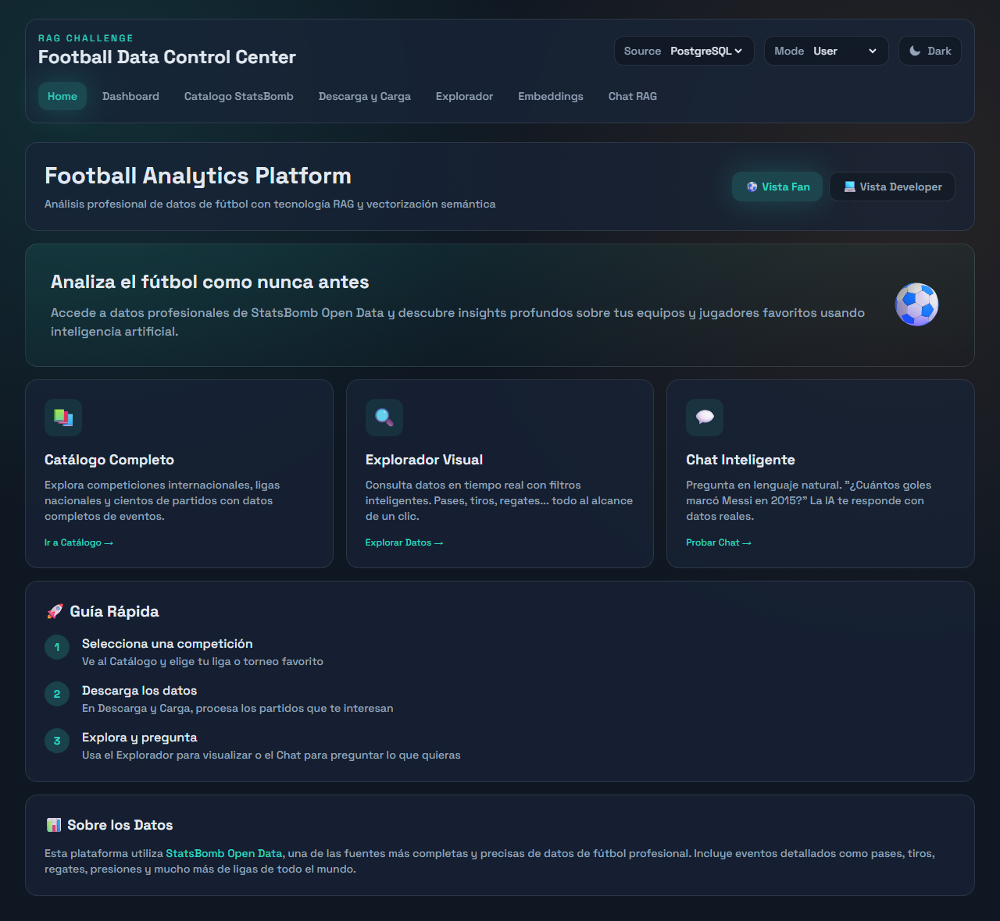

### Developer view — architecture, RAG data flow, and API endpoints

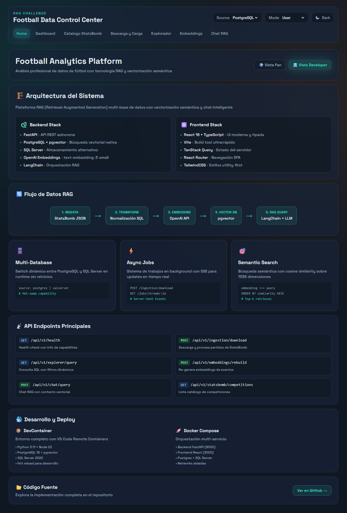

---

## Dashboard

System health monitor showing API status, database connectivity, capabilities, and recent jobs.

### System health: API status, readiness, sources, capabilities matrix

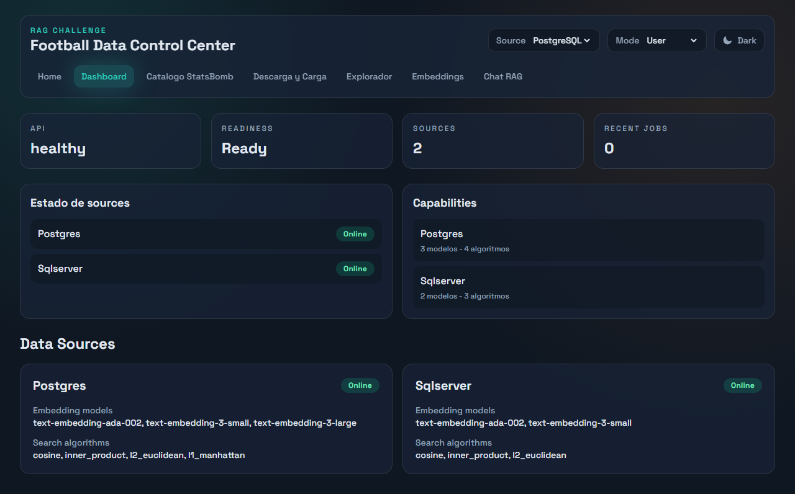

---

## Catalog (StatsBomb)

Browse the StatsBomb Open Data catalog. Select competitions and seasons to see available matches.

### Competitions browser with season grouping

### Matches list for a selected competition/season

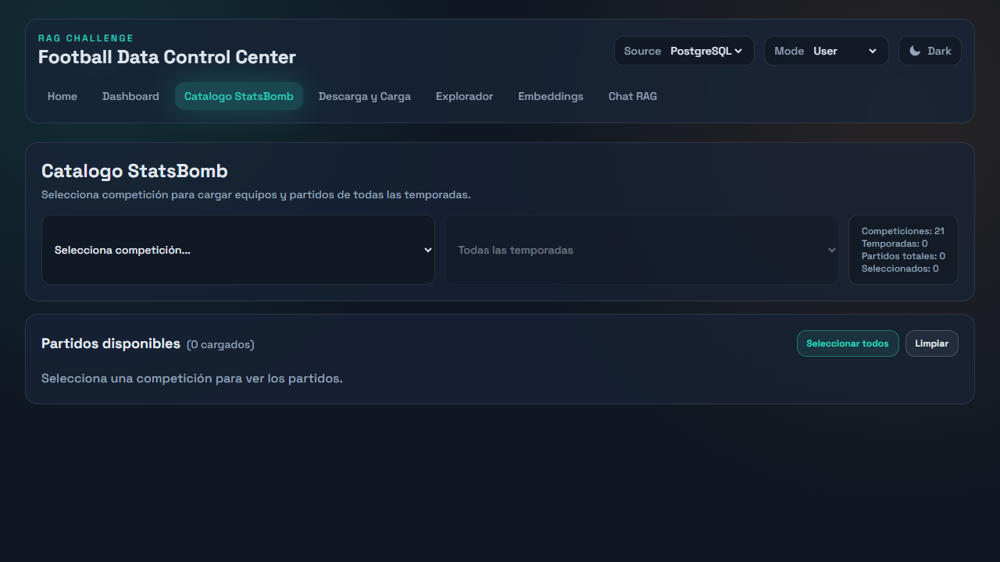

---

## Operations (Pipeline)

Execute the ingestion pipeline: download, load, aggregate, generate summaries, and create embeddings.

### Pipeline controls: step-by-step or full pipeline execution

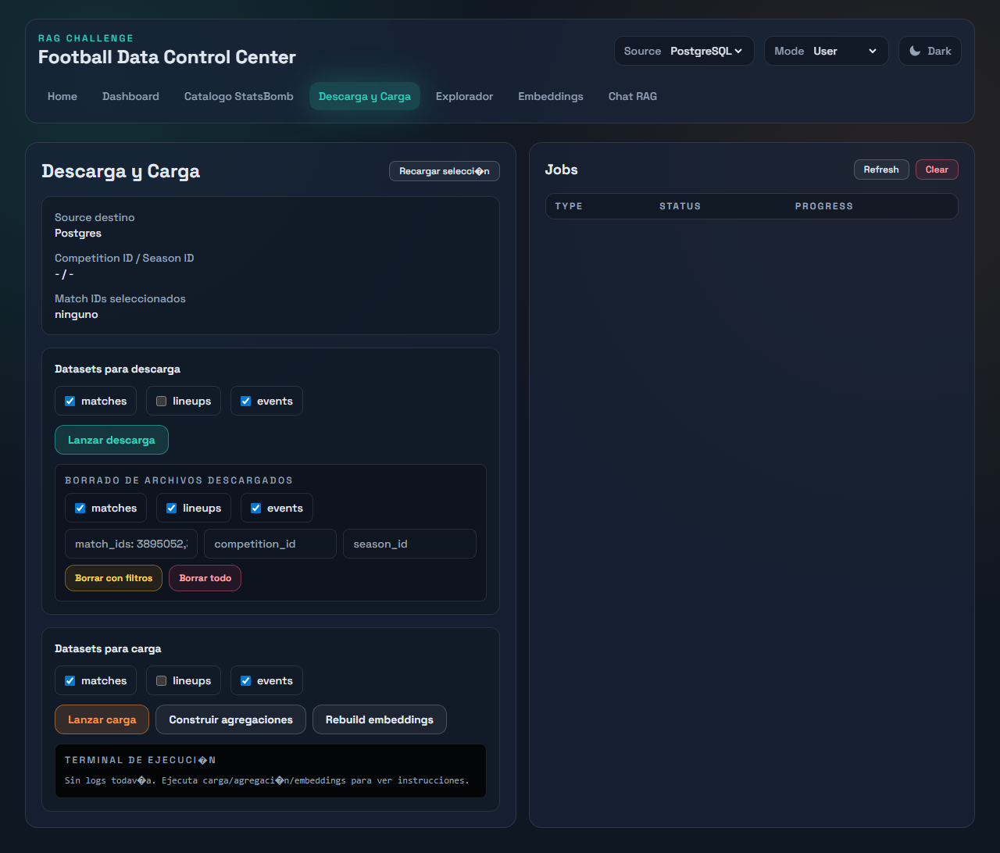

---

## Explorer

Browse data loaded in the database: competitions, matches, teams, players, events, and table info.

### Competitions loaded in the selected database

### Matches with results and match selector

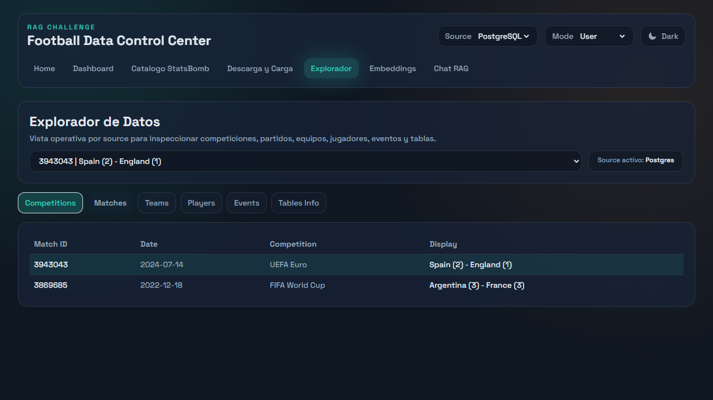

### Teams participating in the selected match

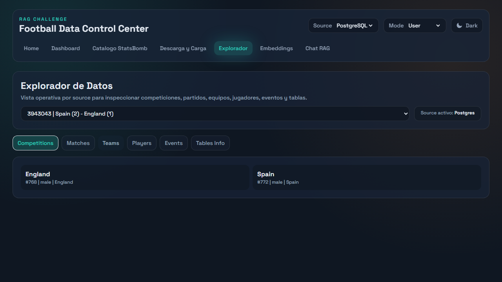

### Detailed events for the selected match

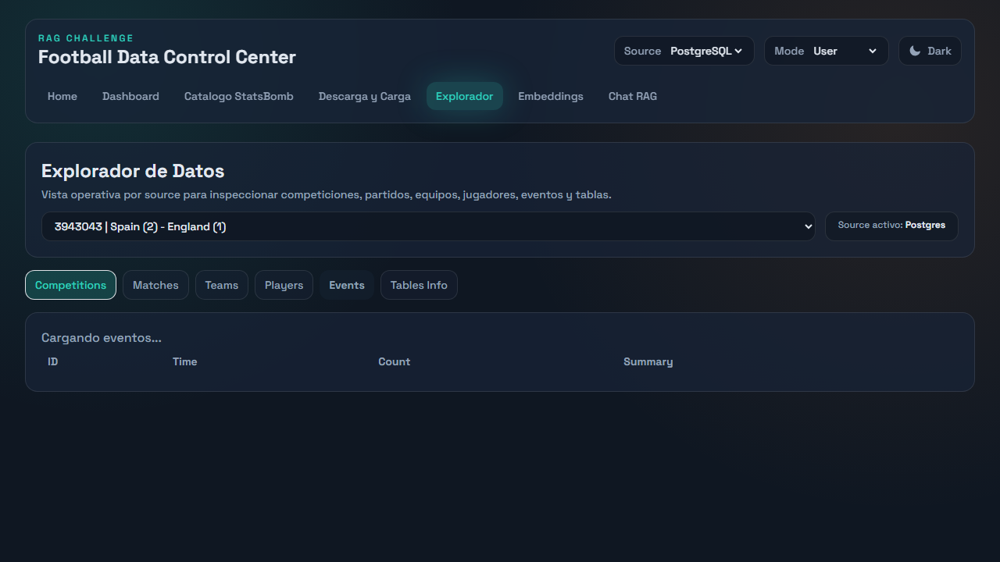

### Database tables with row counts and embedding columns

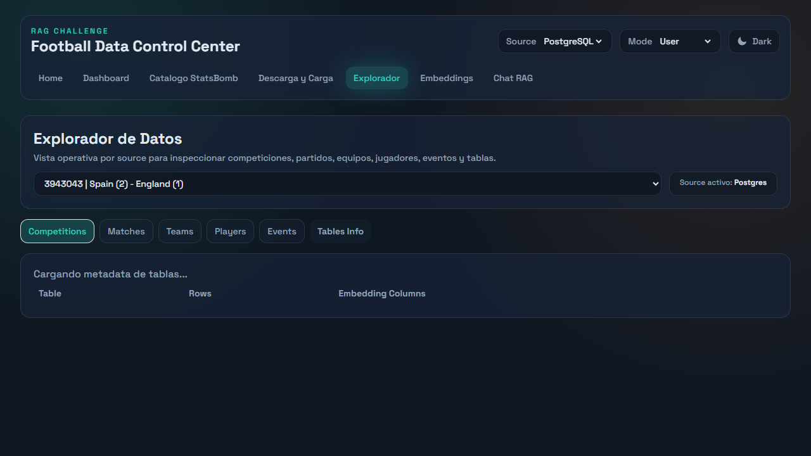

---

## Embeddings

Monitor embedding coverage and rebuild embeddings for specific matches.

### Embedding coverage by model with status counts

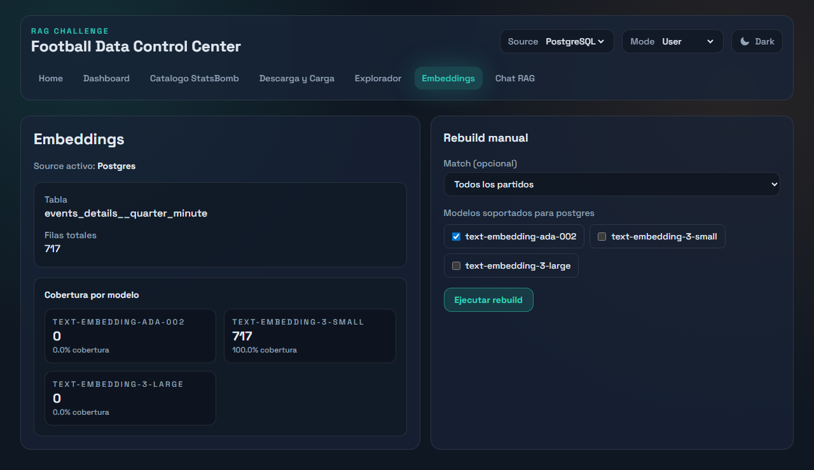

---

## Chat (RAG Search)

Ask natural language questions about football matches. User mode shows clean Q&A; developer mode exposes model selection, algorithm choice, and similarity scores.

### User mode — match selector and question input

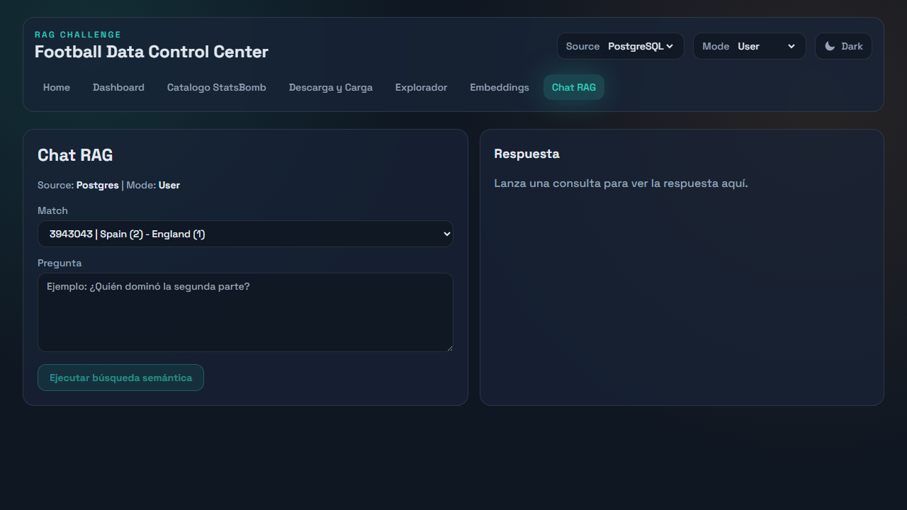

### User mode — RAG answer from real match data

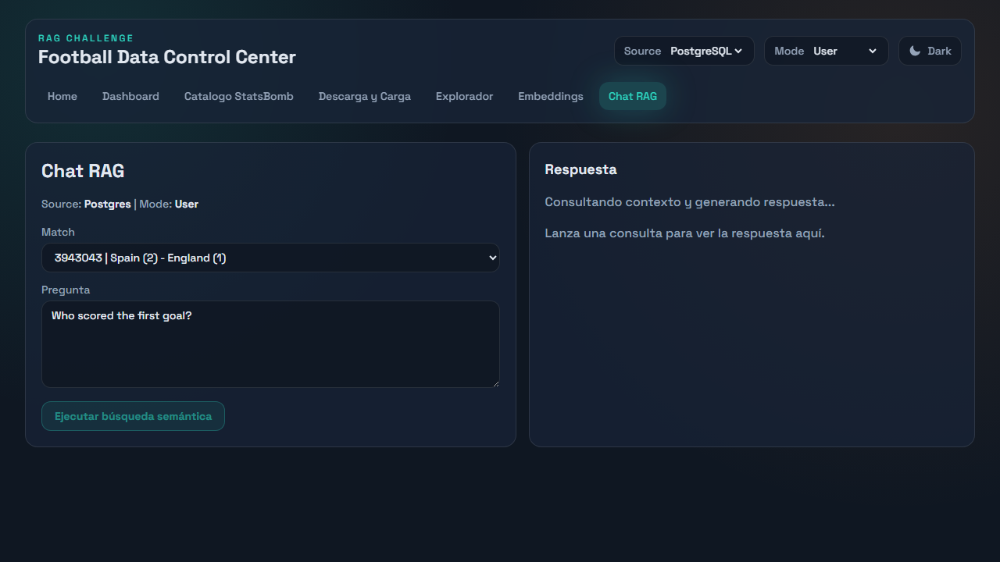

### Developer mode — embedding model and algorithm selectors

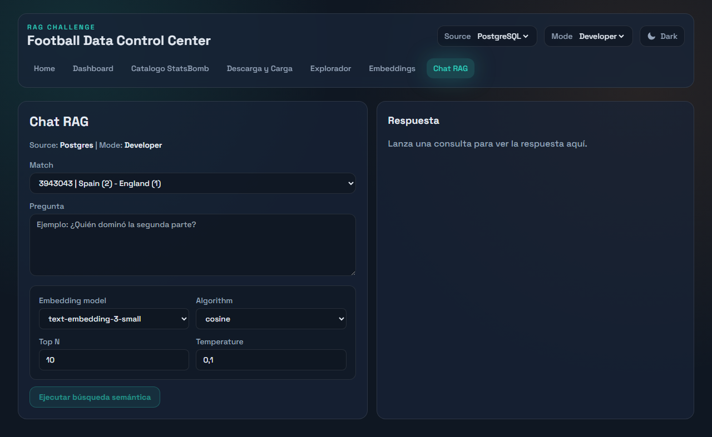

### Developer mode — similarity scores and retrieved fragments

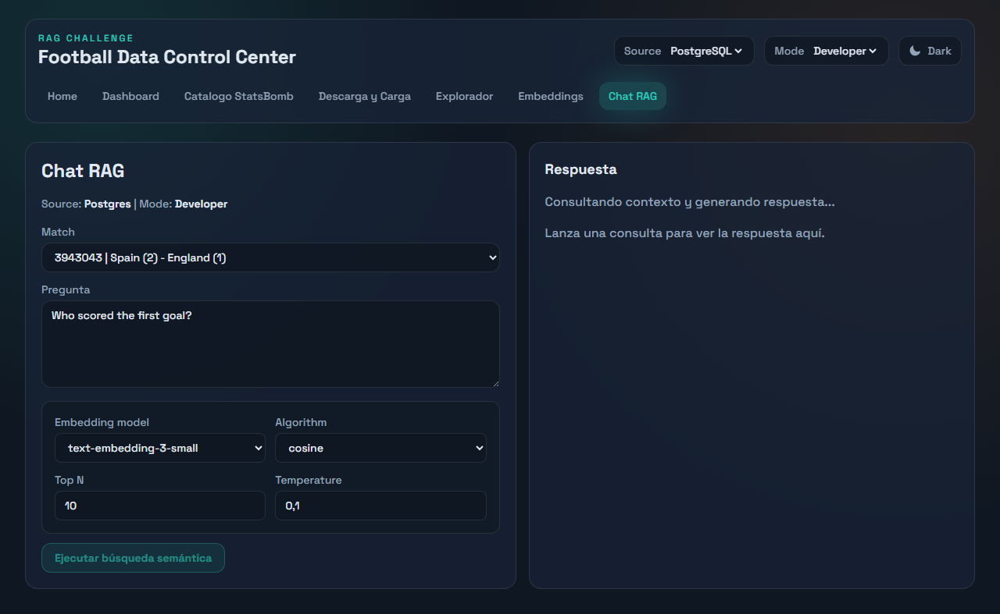

---

## Source Switching

Switch between PostgreSQL and SQL Server at any time using the Source dropdown in the header.

### PostgreSQL as active source

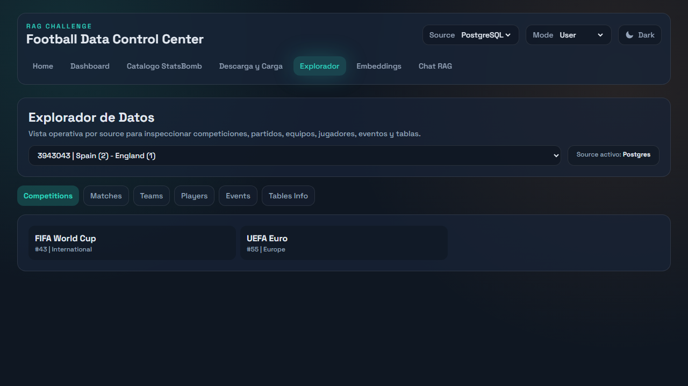

### SQL Server as active source

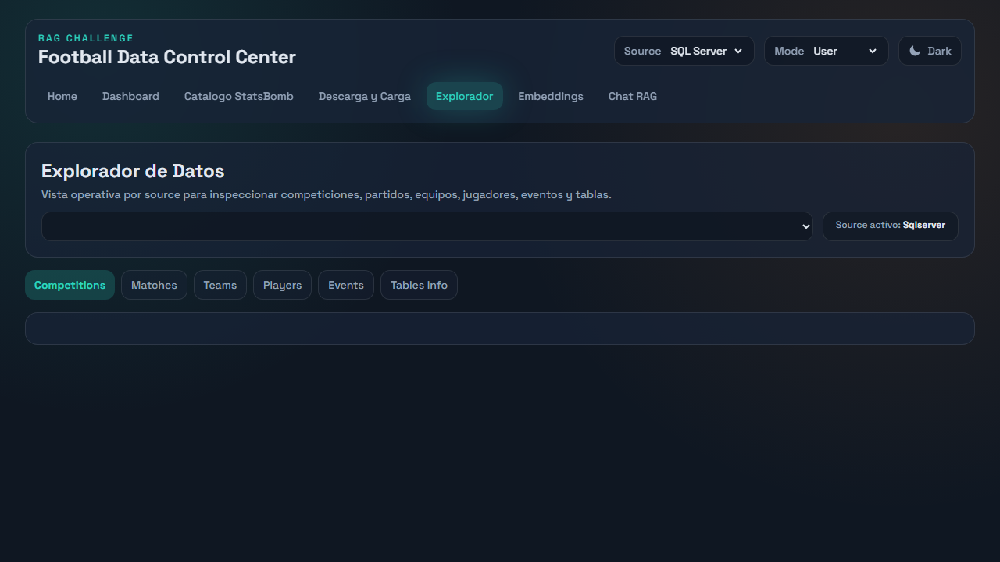

---

