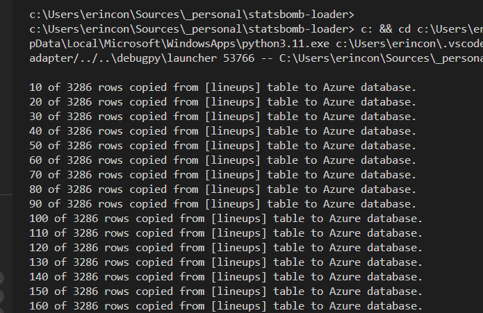

# Introduction

This script is designed to copy data from a PostgreSQL database to Azure, focusing on four football-related tables. The primary function used is `copy_data_from_postgres_to_azure`, which handles the data transfer based on the specified filters.

## Script Functions

1. **Copy Data from Local to Azure**

   The script utilizes the `copy_data_from_postgres_to_azure` function to perform the data transfer. Below are the tables and the applied filters:

   ### 1. `matches` Table

   - **Filter**: The filter ensures that only matches not already present in the destination database are copied, and that they belong to specific competitions in specified years.


### Filtering data

In some cases it would be necessary to fiter data. In that case, `data_filter` variable is used to build the WHERE clause.

```python
   data_filter = """
   NOT EXISTS (SELECT * FROM matches m2 
       WHERE m2.match_id = matches.match_id
       AND (
           (m2.competition_name = 'FIFA World Cup' AND m2.season_name = '2022') OR
           (m2.competition_name = 'UEFA Euro'      AND m2.season_name = '2024') OR
           (m2.competition_name = 'Copa America'   AND m2.season_name = '2024')
       )
   )
   """
```

### Results

While data is loaded, every 10 rows status info is logged to terminal.

