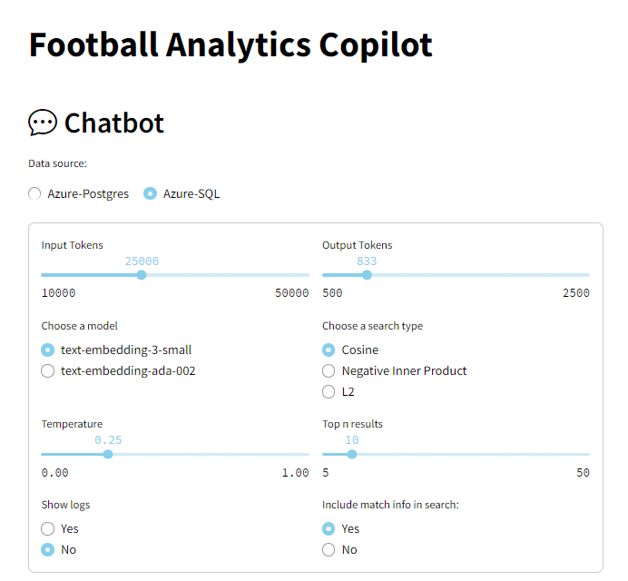
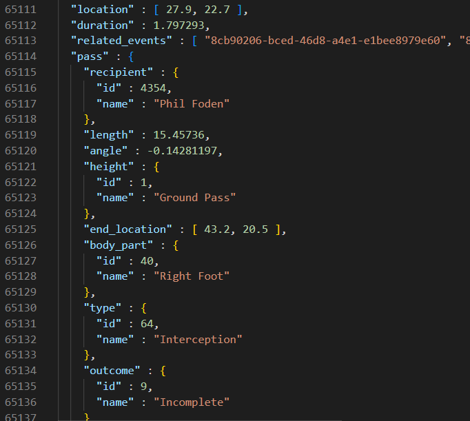
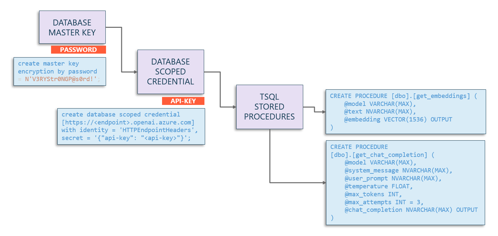

# Using Vector search in Azure SQL PaaS

## The chatbot




The Football Analisys Copilot provides an intuitive interface for users to interact with complex football data without needing advanced technical skills. By utilizing natural language processing, users can ask questions and retrieve detailed insights from vast datasets, including competitions, matches, teams, players, and events. This makes data exploration accessible to analysts, coaches, and fans who may not be familiar with coding or database queries, enabling them to gain valuable information through simple conversations with the chatbot.

Through this interactive platform, users can perform a wide range of analyses, such as querying specific match events, examining team performance, analyzing player statistics, and exploring tactical dynamics. The chatbot employs a Retrieval Augmented Generation (RAG) pattern, which searches the database for relevant embeddings based on the user's query, retrieves pertinent information, and generates coherent summaries using OpenAI's models. This process allows for advanced data analysis and real-time feedback, supporting decision-making and providing deeper insights into football analytics.

Currently, the chatbot is designed to analyze game actions within football matches, offering insights based on in-game events. Users can explore detailed aspects such as the number of successful passes each team completed during specific time frames, identify players with the highest number of carries and passes, or examine defensive actions like tackles and blocks executed by teams. For instance, questions like "Count the successful passes each team completed in the first half (minutes 41-47) and the second half (minutes 45-50), and what impact did these passes have on their game performance?" or "Which players recorded the highest number of carries and passes in both halves, and how did their performances influence the overall strategies of the teams?" are supported. This focused approach allows users to delve into specific match dynamics and player performances based on the event data available.

## Data source

The StatsBomb Open Data offers comprehensive football match information in JSON format across key tables: Competitions (identifying competitions and seasons), Matches (detailed match data including teams, scores, and metadata), Players (player details and lineups), Teams (team information and management details), and Events (in-game actions with attributes like event type, timestamp, and location). For this POC Events, most of the data has been loaded, but only game results game events has been used.

This is a fragment of the sample data where player id `4354`, `Phil Foden`, received a `ground pass` with his `right foot`:



#### Data loading and processing architecture Summary


The diagram shows the technological arquitecture used for this POC:
- Open data from Statsbomb - Foolball data provider - hosted in Github.
- Python application.
- Azure SQL Database.
- Azure OpenAI Service.

These are the steps to load the data into Azure SQL Database:
1) Download the JSON data from Github to local.
2) Insert the data into Azure SQL Database.
3) Convert the JSON data in 15-secs chunks to prose description using the SQL Server `get_chat_completion` stored procedure descibed below.
4) Convert the 15-secs prose description to vector embeddings using the SQL Server `get_embeddings` described below.

Steps 1, and 2 are detailed in the repo: https://github.com/erincon01/rag-challenge

To avoid sharing api-keys in stored procedures I suggest using `database credentials` following this diagram:


By doing this, you can call the `sp_invoke_external_rest_endpoint` stored procedure referencing the credential instead of putting the api-key in flat text.

Lets get focus on the SQL Azure Database section:

### Stored procedure to convert the JSON data to prose summary


Stored procedure definition, that get as input parameters the data parameters to configure the call to Azure OpenAI, and returns as OUTPUT the result of the call. Aditionally, includes a retry policy for throthling scenarios:

```tsql
CREATE PROCEDURE [dbo].[get_chat_completion]
(
    @model VARCHAR(MAX),
    @system_message NVARCHAR(MAX),
    @user_prompt NVARCHAR(MAX),
    @temperature FLOAT,
    @max_tokens INT,
    @max_attempts INT = 3,
    @chat_completion NVARCHAR(MAX) OUTPUT
)
```

Section where the payload, and the Azure OpenAI call is prepared:

```tsql
SET @url = N'https://<endpoint>.openai.azure.com/openai/deployments/' + @model + '/chat/completions?api-version=2023-05-15';

SET @payload = JSON_OBJECT('messages': JSON_ARRAY(
    JSON_OBJECT('role': 'system', 'content': @system_message),
    JSON_OBJECT('role': 'user', 'content': @user_prompt)),
    'temperature': @temperature,
    'max_tokens': @max_tokens);
```

And the call to `sp_invoke_external_rest_endpoint` and return message processing:

```tsql
EXEC dbo.sp_invoke_external_rest_endpoint
    @url = @url,
    @method = 'POST',   
    @payload = @payload,   
    @credential = 'https://<endpoint>.openai.azure.com',
    @response = @response OUTPUT;

SET @chat_completion = JSON_VALUE(@response, '$.result.choices[0].message.content');
```

If Azure OpenAI response includes a 429 error, means that you are reaching the limits of your model. We have implemented logic to retry-after the seconds the error suggests.
additionally, a 3 retries logic is implemented for cases where the Azure OpenAI model is used concurrently by other user. 

``` tsql
IF JSON_VALUE(@response, '$.result.error.code') = '429'
BEGIN
    DECLARE @retryAfter NVARCHAR(10);
    SET @retryAfter = JSON_VALUE(@response, '$.response.headers."Retry-After"');
    -- Declare a variable to store the Retry-After value as an integer
    -- Convert the Retry-After value to an integer and add 1 second
    DECLARE @retryAfterSeconds INT;
    SET @retryAfterSeconds = CAST(@retryAfter AS INT) + 1;

    -- Calculate hours, minutes, and seconds for the HH:MM:SS format
    DECLARE @hours NVARCHAR(2), @minutes NVARCHAR(2), @seconds NVARCHAR(2);

    SET @hours = RIGHT('0' + CAST(@retryAfterSeconds / 3600 AS NVARCHAR), 2);
    SET @minutes = RIGHT('0' + CAST((@retryAfterSeconds % 3600) / 60 AS NVARCHAR), 2);
    SET @seconds = RIGHT('0' + CAST(@retryAfterSeconds % 60 AS NVARCHAR), 2);

    DECLARE @delay NVARCHAR(8);
    SET @delay = @hours + ':' + @minutes + ':' + @seconds;

    PRINT 'Rate limit error detected. Retry-After: ' + @delay + '. Attempt ' + CAST(@attempts AS NVARCHAR(10)) + '.';                    
    WAITFOR DELAY @delay;
END
```

The complete stored procedure code can be downloaded from the repo. 


### Stored procedure to convert text summary to vector embedding 

In order to convert the prose summary to vector embedding, the `sp_invoke_external_rest_endpoint` is used too.

This is the code we have used:

```tsql
CREATE PROCEDURE [dbo].[get_embeddings]
(
    @model VARCHAR(MAX),
    @text NVARCHAR(MAX),
    @embedding VECTOR(1536) OUTPUT
)
AS
BEGIN

    SET NOCOUNT ON;

    DECLARE @retval INT, @response NVARCHAR(MAX);
    DECLARE @url VARCHAR(MAX);
    DECLARE @payload NVARCHAR(MAX) = JSON_OBJECT('input': @text, 'dimension': 1536);

    -- Set the @url variable with proper concatenation before the EXEC statement
    SET @url = 'https://<endpoint>.openai.azure.com/openai/deployments/' + @model + '/embeddings?api-version=2023-03-15-preview';

    EXEC dbo.sp_invoke_external_rest_endpoint 
        @url = @url,
        @method = 'POST',   
        @payload = @payload,   
        @credential = [https://<endpoint>.openai.azure.com],
        -- @headers = '{"Content-Type":"application/json", "api-key":"<api-key"}', 
        @response = @response OUTPUT;

    -- Use JSON_QUERY to extract the embedding array directly
    DECLARE @jsonArray NVARCHAR(MAX) = JSON_QUERY(@response, '$.result.data[0].embedding');
    
    SET @embedding = CAST(@jsonArray as VECTOR(1536));
END
```
 Note that we are using the `database credential` created earlier. The `@header` argument is commented in case you need to use flat api-key.


### Updating the summary and the embeddings columns in the tables

In order to update the `events_details__15secs_agg` table, we have create a very simple stored procedure, that for a given match_id, all the prose details are calculated:


This is the definition:
```tsql
CREATE PROCEDURE dbo.add_summary_to_json_in_events_details__15secs_agg
    @system_message NVARCHAR(MAX),
    @model VARCHAR(MAX),
    @temperature FLOAT,
    @max_tokens INT,
    @max_attempts INT = 3,
    @match_id INT = NULL
```

That iterates for each row of the match; if a game has 90 minutes, there would be aprox 90 * 4 = 360 rows per match, having this code, as core section:

```tsql
-- convert json to summary/script
EXEC dbo.get_chat_completion @model = @model, @system_message = @system_message, @user_prompt = @json, 
    @temperature = @temperature, @max_tokens = @max_tokens,
    @max_attempts = @max_attempts,  @chat_completion = @summary OUTPUT;

-- calculate embeddings
EXEC dbo.get_embeddings @model = 'text-embedding-ada-002', @text = @summary, @embedding = @embedding_ada_002 OUTPUT;
EXEC dbo.get_embeddings @model = 'text-embedding-3-small', @text = @summary, @embedding = @embedding_3_small OUTPUT;

IF (NOT @summary IS NULL AND @summary <> '')
BEGIN
    UPDATE events_details__15secs_agg
    SET
        summary = @summary,
        embedding_ada_002 = @embedding_ada_002,
        embedding_3_small = @embedding_3_small
    WHERE
        match_id = @_match_id AND
        period = @period AND
        minute = @minute AND
        _15secs = @_15secs;
END
```

Note that for this POC, for tesing purposes, we have calculated embeddings for two models: `text-embedding-ada-002`, and `text-embedding-3-small`.

### Querying the data

Data is organized arround the matches table. For a give match, there are multiple rows in lineups, players, events, events_details, and events_details__xxx_agg tables:
- Matches table includes teams involved, referee data, competition name, season name, date of the game, each team trainer, and the result.
- In football, the lineup are 11 players each team excluding substitutions.
- The game has multiple events, likes passes, shots on goal, goalkeeper saves, faults, goals, penalties, etc.
- Events_details tabla includes all the actions that hapenned in a given game.
- The For this POC, we have tested 2 splits:
    - In the minute aggregations, events_details are splitted per minute.
    - In the 15-secs aggregations, events_details ae splitted in 4 groups per minute.

#### Vector search pattern in SQL Azure Databases

SQL Azure databases includes native functions for vector search for euclidean (L2), cosine, and negative inner product:
https://devblogs.microsoft.com/azure-sql/announcing-eap-native-vector-support-in-azure-sql-database/#vector_distance


```tsql
DECLARE @v1 VARBINARY(8000) = JSON_ARRAY_TO_VECTOR('[1,1]')
DECLARE @v2 VARBINARY(8000) = JSON_ARRAY_TO_VECTOR('[-1,-1]')

SELECT 
    VECTOR_DISTANCE('euclidean', @v1, @v2) AS euclidean,
    VECTOR_DISTANCE('cosine', @v1, @v2) AS cosine,
    VECTOR_DISTANCE('dot', @v1, @v2) AS negative_dot_product;
```

Using the `text-embedding-3-small` embedding model, the query pattern for the three types of vector searchs would be like this:

```tsql
DECLARE @e_3small VECTOR(1536);
DECLARE @string nvarchar(max) = 
    'Which players recorded the highest number of carries and passes in both halves, 
    and how did their performances influence the overall strategies of the teams?'

EXEC dbo.get_embeddings @model = 'text-embedding-3-small', @text = @string, @embedding = @e_3small OUTPUT;

SELECT TOP (10) 
    VECTOR_DISTANCE('cosine', @e_3small, embedding_3_small) AS distance_cosine_3_small, *
from events_details__15secs_agg where match_id = 3943043 
ORDER BY 1;

SELECT TOP (10) 
    VECTOR_DISTANCE('euclidean', @e_3small, embedding_3_small) AS distance_euclidean_3_small, *
from events_details__15secs_agg where match_id = 3943043 
ORDER BY 1;

SELECT TOP (10) 
    VECTOR_DISTANCE('dot', @e_3small, embedding_3_small) AS distance_dot_3_small, *
from events_details__15secs_agg
where match_id = 3943043 
ORDER BY 1 desc;
```

If you need to encapsulale all three vector searchs in a single pattern, the result would be like this:

```tsql
DECLARE @e VECTOR(1536);
DECLARE @string nvarchar(max) = '<search_string>'

EXEC dbo.get_embeddings @model = '<embedding_model>', @text = @string, @embedding = @e OUTPUT;

SELECT TOP (<top_n>) 
    VECTOR_DISTANCE('<search_type>', @e, <embedding_column_name>) AS distance, *
from <table> 
ORDER BY 1 <ASC|DESC>;
```

The tricky part is the `ORDER BY` clause that can be addressed with this logic in Python:

```python
k_search = "#"
k_search_sqlazure = "cosine"
order_by = " ASC"
if search_type.lower() == "cosine":
    k_search = "="
    k_search_sqlazure = "cosine"
    order_by = " ASC"
if search_type.lower() == "innerp":
    k_search = "#"
    k_search_sqlazure = "dot"
    order_by = " DESC"
if search_type.lower() == "l1":
    k_search = "+"
    k_search_sqlazure = "euclidean"
    order_by = " ASC"
if search_type.lower() == "l2":
    k_search = "-"
```

The Transact-SQL query coded in Python would look like this:

```python
if source == "azure-sql":
    table_name = "events_details__15secs_agg"
    query = f"""
        DECLARE @e VECTOR(1536);
        EXEC dbo.get_embeddings @model = '{model_name}', @text = '{search_term}', @embedding = @e OUTPUT;

        SELECT TOP {top_n} id, {summary}
            , VECTOR_DISTANCE ('{k_search_sqlazure}', @e, {column_name_sql}) AS Distance
        FROM {table_name} 
        WHERE match_id = {match_id}
        ORDER BY Distance {order_by};
    """

df1 = pd.read_sql(query, conn)
rowCount = df1.shape[0]
```

#### RAG pattern in pyhon

Once we have the rows that match the search criteria, we need to add the adjacent rows. The reason is to add more context to the data before calling `chat_completion`. In our scenario, `id` column is an `IDENTITY` column, that for our testing scenario was sufficient to simulate data-ordering load. In Pyhon we have created some code in order to find the previous and the next row from the searched rows. The code includes:
- Removing duplicate rows.
- Go to Azure SQL database to get the text script using the function `get_dataframe_from_ids`.
- Merge and order the data.

```python
# get the ids from the seach (id is the primary key)
ids = df1['id'].values
extended_ids = []

# for each id, add the previous and next id
for i in ids:
    extended_ids.append(i-1)
    extended_ids.append(i+1)

# remove duplicates and order by id
ids = list(set(extended_ids))
ids.sort()

# add to the dataframe the previous and next rows
df2 = get_dataframe_from_ids(source, table_name, summary, ids)

# concatenate results
df = pd.concat([df1, df2], ignore_index=True)
df = df.drop_duplicates(subset='id', keep='first')
df = df.sort_values(by='id')
# remove the id column from df
df = df.drop(columns=['id'])
```

Additionally, we have included some `business data`, like game results, and we did some testing adding game lineups, but was not relevant for our tests.

And then, we build the prompt that will call the `get_chat_completion_from_azure_open_ai` python funtion:

```python
prompt=""
prompt += f"### EVENTS\n" + df.to_string(index=False, justify='left')

if add_match_info.lower() == "yes":
    d_match_info = get_game_result_data(source, match_id)
    prompt += f"\n\n### GAME RESULT\n" + d_match_info

prompt += f"\n\n### PROMPT\n{search_term}"
```

The `get_chat_completion_from_azure_open_ai` python function is as simple as this:


```python
def get_chat_completion_from_azure_open_ai(system_message, user_prompt, temperature, tokens):
    """
    Retrieves a chat completion from Azure OpenAI API.
    Args:
        system_message (str): The system message.
        user_prompt (str): The user prompt.
        temperature (float): The temperature value for generating chat completions.
        tokens (int): The maximum number of tokens for generating chat completions.
    Returns:
        str: The generated chat completion.
    """
    client = AzureOpenAI(
        azure_endpoint=os.getenv('OPENAI_ENDPOINT'),
        api_key=os.getenv('OPENAI_KEY'),
        api_version="2023-05-15"
    )

    response = client.chat.completions.create(
        model=os.getenv('OPENAI_MODEL'),
        messages=[
            {"role": "system", "content": system_message},
            {"role": "user", "content": user_prompt},
        ],
        temperature=temperature,
        max_tokens=tokens,
    )

    output = response.choices[0].message.content

    output = output.replace('\n\n', '\n').replace('\n\n', '\n')

    return output
```


